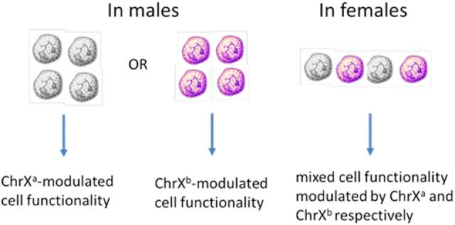

# ABSTRACT
 
**THE ROLE OF IRAK-1 TRANSCRIPTS IN SEPSIS**

**by**

**Adithya Subramanian Sahasranamam**

Sepsis is a complex, life-threatening syndrome that can lead to systemic organ failure and dysfunction. Due to its high morbidity and mortality rates, it has become a critical global health issue. Although many factors are at play during sepsis, the primary ones include abnormal inflammation and a lack of oxygen supply to the tissues and muscles. The interleukin-1 receptor-associated kinase (IRAK) family plays a crucial role in eliciting innate immune responses and switching to adaptive immune responses in the presence of pathogens. IRAKs are vital components in the interleukin-1 receptor signaling pathway and some Toll-like receptor signaling cascades that elicit inflammatory reactions in response to injury and infection. Disturbances in the homeostasis of IRAK signaling cascades can lead to a plethora of immunological problems. This paper seeks to understand the molecular mechanisms of IRAK-1 and compare its splice variants and polymorphisms in the context of inflammation and sepsis.

#### **THE ROLE OF IRAK-1 TRANSCRIPTS IN SEPSIS**

**by**

**Adithya Subramanian Sahasranamam**

**A Dissertation**

**Submitted to the Faculty of**

**New Jersey Institute of Technology**

**in Partial Fulfillment of the Requirements for the Degree of**

**Master of Science in Biological Sciences**

**Department of Biology**

**March 2021**

Blank page

.

**APPROVAL PAGE**

**The ROLE OF IRAK-1 TRANSCRIPTS IN SEPSIS**

**Adithya Subramanian Sahasranamam**

Dr. Nan Gao, Dissertation Advisor Date

Associate professor of Biology, Rutgers University - Newark

Dr. Patrick Morcillo, Committee Member Date

Research Teaching Specialist, New Jersey Medical School, Rutgers University

Dr. Dirk Bucher, Committee Member Date

Professor of Biology, New Jersey Institute of Technology

**BIOGRAPHICAL SKETCH**

Author: Adithya Subramanian Sahasranamam

Degree: Master of Science

Date: Mar 2021

Date of Birth: August 25, 1997

Place of Birth: Coimbatore, Tamil Nadu, Republic of India

Undergraduate and Graduate Education:

* Bachelor of Science in Biology & Computer science,

Valparaiso University, Valparaiso, United States, 2018

Major: Biology

To Dr. Grayson Davis,

A wonderful teacher of life sciences who also teaches about life.

I hope you like it, sir.

To Sahasranamam Subramania Iyer,

One of the smartest engineers I have met in this lifetime.

When my time comes, we shall catch some films in heaven.

**ACKNOWLEDGMENT**

I would like to start by thanking Dr. Nan Gao at Rutgers Newark for his support and help with my paper. I am greatly indebted to his help and support throughout. I extend my gratitude towards Dr. Patrick Morcillo, my research advisor, for taking time despite his busy and tenuous schedule to help me with my work. His constant support and words of encouragement have meant the world to me even during the direst times. I would also like to thank everyone at the Spolarics Lab at the New Jersey Medical School for coaching me and for their insightful advice and wisdom.

Furthermore, I would like to thank all my peers at NJIT for their inspiration and a very memorable experience. I would also like to thank my brothers at Sigma Pi for always lending an ear, listening to my concerns, and virtually addressing them. Special thanks to Jackson Block for putting up with my shenanigans and keeping hope always burning. I am indebted to Professor Alamelu Venkataraman for our impromptu lectures between her patient visits. Finally, I would like to thank my family for their unwavering support. I could not have made it this far without them.

| **TABLE OF CONTENTS** |
| :---------------: |
| **Chapter** |
| 1 |
| 2 |
|  |
|  |
|  |
|  |
|  |
| 3 |
|  |
|  |
|  |
|  |
|  |
| 4 |
|  |
|  |
|  |
| 5 |
|  |
|  |
 
| **TABLE OF CONTENTS**  **(Contd.)** |
| :-----------------------: |
| **Chapter** |
|  |
| 6 |
|  |
|  |
|  |
|  |
|  |
| 7 |
|  |
|  |
|  |
| APPENDIX A SUPPLEMENTAL DATA & SAMPLE STATISTICAL CODE … |
|  |
|  |
| BIBLIOGRAPHY…………...……………………………………………………... |
 
| **LIST OF TABLES** |
| :------------: |
| **Table** |
| 1.1 |
| 5.1 |
| 6.1 |
| 6.2 |
| 6.3 |
 
| **LIST OF FIGURES** |
| :-------------: |
| **Figure** |
| 2.1 |
| 2.2 |
| 2.3 |
| 2.4 |
| 4.1 |
| 4.2 |
| 4.3 |
| 6.1 |
| 6.2 |
| 6.3 |
| 6.4 |

**CHAPTER 1**

**INTRODUCTION**

Systemic inflammatory response syndrome (SIRS) is a generalized immunological response against a vast range of pro-inflammatory pathologies, including infection, injury, trauma, and burns. SIRS is often characterized by significant changes in the body temperature and the onset of tachycardia, rapid breathing, and abnormalities in white blood cells (WBCs) and red blood cell (RBCs) counts and can give rise to systematic multi-organ dysfunction. When the onset of infection causes SIRS, the phenomenon is known as sepsis. Sepsis is a life-threatening inflammatory response that can give rise to systematic multi-organ dysfunction and failure caused by either trauma or infection.

Despite modern advances in elucidating the pathophysiology of sepsis, the condition remains one of the primary causes of mortality and morbidity in intensive care units (ICUs) worldwide. Current estimates suggest that sepsis affects more than 30 million people and accounts for more than six million deaths per annum worldwide. Based on the Surviving Sepsis Campaign data from 2012, 41% and 28.3% of reported deaths from sepsis occurred in Europe and the United States, respectively [1]. The study also found sepsis to be the most expensive health care condition in the United States annually, setting back American hospitals by USD 20 billion in 2011 alone [3]. These financial and mortality costs make the investigation of sepsis's molecular mechanisms a top priority to elucidate possible immune modulation therapies to more effectively treat patients afflicted by sepsis.

Severe sepsis is when the host's reaction to infection causes a systemic cascade of organ failures in a manner referred to as septic shock [1-6]. Sepsis is believed to cause organ failure through the uncontrolled upregulation of systemic immune responses. However, in light of medical and scientific advancements, ICU survival rates have improved, which led to the detection of the immunosuppression phase in the later stages of sepsis pathophysiology, ultimately explaining the high mortality rates. This syndrome was termed "compensatory anti-inflammatory response syndrome" (CARS) by Bone in his 1996 paper [4]. Similar to SIRS, CARS is a complex immune system response to severe infection; however, CARS is believed instead to be a condition marked by systematic inhibition of the immune system that restores homeostasis after the period of extreme inflammation. This led scientists and medical professionals to use the terms SIRS and CARS to differentiate the host's pro- and anti-inflammatory responses to a broad range of infectious and noninfectious stimuli [6–9].

While initial studies categorized CARS as the phase that appears at the end of or even after SIRS, researchers have since found evidence of pathways that support the idea that CARS is not a part of SIRS. Instead, CARS may exist entirely separately from SIRS and encompass an additional set of cellular and molecular interactions and pathogenesis pathways different from those of SIRS. However, CARS may also significantly influence sepsis and lead to adverse outcomes. Earlier studies of the pro-inflammatory phase of sepsis have helped to improve survival rates in the ICU. The emergence of an immunosuppression phase in the later stages of sepsis pathophysiology often left the patient vulnerable to secondary infections, which could explain the high mortality rates [10]. Indeed, later studies revealed that the anti-inflammatory responses elicited by CARS induce a severe immunosuppressed state wherein the immune system cannot recover despite eradicating pathogens from the body, which, as a phenomenon, has been termed “immune paralysis” [5].

Modern advances have reduced the rates of deaths occurring during sepsis's initial stages as homeostasis is reestablished early on in the disease's pathophysiology. However, those patients who fail to achieve homeostasis during the early phases of SIRS/CARS enter a state marked by high mortality and morbidity rates, typically exhibiting severe weakness, malnutrition, chronic infections, and cognitive decline, which has come to be known as chronic critical illness [10–13].

Data from 2009 indicate that the annual health care costs for patients with chronic critical illness exceeded $20 billion. The majority of these patients (> 60%) were admitted with a sepsis diagnosis [12], and only 20% were ultimately discharged home; more than 40% were discharged to long-term acute care and skilled nursing facilities [11, 12], while 30% died in the hospital [12].

Due to its associated high mortality rates, CARS soon became a target for immune-modulating therapies [14]. However, despite extensive preclinical research into possible immunomodulatory therapies for CARS, not many treatment solutions to date have been implemented [15]. Later studies found that, during CARS’ immunosuppressive phase, an increase in the levels of pro-inflammatory cytokines such as C-reactive protein (CRP), interleukin (IL)-6, IL-1, and tumor necrosis factor (TNF) receptor [14, 16] occurred, together with a substantial rise in the recruitment and release of immature myeloid leukocytes associated with chronic inflammation [17]. These studies have supported the design of a more fluidic model of sepsis with simultaneous inflammatory and immunosuppressive processes. This evidence eventually led to the replacement of the traditional SIRS/CARS model with the concept of persistent inflammation–immunosuppression catabolism (PICS) [6].

PICS is characterized by a low but constant, chronic state of inflammation that paralyzes the host's immune system while exerting drastic catabolic effects on the body mass’ nutritional intervention [7, 13]. The key adaptive immune features that once typified CARS are now understood to fall under the larger umbrella of PICS. These processes include immune cell metabolic failure, decreased T-cell numbers, lymphocyte dysfunction, increased apoptosis, increased T-cell suppressor function, reduced T-cell repertoire, significant shifts in cytokine polarization toward humoral and TH2 cytokines, diminished membrane-associated human leukocyte antigen receptors, and epigenetic modifications secondary to the cell microenvironment [1, 22, 23, 28–33]. The definitions and diagnostic criteria for sepsis and PICS are defined in Table 1.1.

While the etiology or pathophysiology of PICS has not been completely elucidated, extensive studies on pro-and anti-inflammatory cytokines and chemokines have revealed the sheer breadth of sepsis and its many modes of action. Recently developed controversial theories suggest that the role of endotoxins and immunosuppressive SIRS medication might be secondary to the role of endogenous molecules like catecholamines [18, 36], corticosteroids [19, 20, 21], and IL-10 [22–27].

**PAGE2**

**Table 1.1** The Terminologies and definitions of sepsis

| **Term** | **Definition** |
| ---- | ---------- |
| Infection | The invasion of an organism by a pathogen that elicits a pro-inflammatory response |
| Sepsis | An extremely dysregulated immune response from the host in response to infection. |
| Onset of Sepsis | Observation of dysfunction in a new organ, away from the original site of infection |
| Sequential Organ Failure Assessment score (SOFA score) | The SOFA score is used to track a patient's status by determining the extent and severity of a patient's organ function over time. It uses data from the Cardiovascular, respiratory, hepatic, renal, and neurological organ systems for calculation. |
| Rapid bedside organ dysfunction score – qSOFA | A quick test that suggests potential Organ dysfunction if at least two of the following is present: |
 
| Altered Mental Status – Glasgow Coma Scale ≤ 14 |
| ----------------------------------------------- |
| Systolic Blood Pressure ≤ 100 mmH |
| Respiratory Rate 22 breaths per min |
 
|  |  |
| --- | --- |
| Organ Dysfunction | A significant change in the SOFA score by at least two points at a site remote from infection, |
| Septic Shock | A state of sepsis that elicits a cascade of profound changes in the vasculature, metabolism, cellular, and organ functions. |
| PICS |  |
| Critically ill patient | Admission to the ICU > 14 days |
| ---------------------- | ------------------------------ |
| Persistent inflammation | CRP > 50 μg/dL |
|  | Retinol binding protein < 1 mg/dL |
| Immunosuppression | Total lymphocyte count < 0.80 ×109/L |
| Catabolic state | Serum albumin < 3.0 g/dL |
|  | Creatinine height index < 80% |
|  | Weight loss > 10% ‘or’ BMI < 18 during hospitalization |
|  |  |
| :--- | :--- |

Source: Mira, J. C., Gentile, L. F., Mathias, B. J., Efron, P. A., Brakenridge, S. C., Mohr, A. M., ... & Moldawer, L. L. (2017). Sepsis pathophysiology, chronic critical illness s, and PICS. Critical care medicine, 45(2),
**PAGE 6**

**CHAPTER 2**

**THE MOLECULAR PATHWAYS OF SEPSIS.**
\*\*

The host's body initially promotes an innate pro-inflammatory response as a response to pathogens, which is arbitrated by antigen-presenting cells (APCs). These cells express pattern-recognition receptors (PRRs) on their surface, which can detect pathogen-associated molecular patterns (PAMPs) expressed on a pathogen's surface or through the release of damage-associated molecular patterns (DAMP) as a result of tissue damage [34]. Upon recognition, the PRRs activate various receptors such as the nucleotide-binding oligomerization domain (NOD)-like receptors and Toll-like receptors (TLRs). The activation of these receptors causes a cascade of reactions across multiple pathways that promote the manufacture of pro-inflammatory cytokines and chemokines, which trigger second messenger cascades, resulting in amplified immune responses [35].

Cytokines and chemokines are crucial mediators of immune responses as they enable the recruitment of leukocytes to the site of infection/injury and increase the permeability of the endothelial vasculature, allowing for the localization of leucocytes [36, 37]. Cytokines and chemokines also facilitate communication between immune cells and their mediators and among adipocytes, fibroblasts, and endothelial cells. Additionally, cytokines and chemokines allow for interactions between the various cascade systems responsible for eliciting immune responses to occur [38–41].

The NOD-like receptor group aggregates to form larger protein complexes called inflammasomes [7]. These protein complexes play a vital role in the production and release of critical cytokines IL-1β and IL-18. They are also involved in the formation of caspases, which are implicated in apoptosis [42]. These pro-inflammatory cytokines elicit leukocyte proliferation, upregulate chemokine expression and express tissue factor production, and induces the production of hepatic acute-phase reactants, which are important mediators produced in the liver during times of acute and chronic inflammation [43, 44].

The name interleukin was suggested in 1979, which means "communication between leukocytes" [45, 46]. Many of these proteins are produced by and act on leukocytes, but cells from other tissues can also secrete them. They exert complex immune-modulatory functions, including cell proliferation, maturation, migration, and adhesion [47-49].

During sepsis, these immune responses are amplified, leading to damage and death of tissues and cells. Recent studies that have analyzed the association between IL-18 levels and mortality [50–52] suggest the role of inflammasomes and autophagy as potential targets in the treatment of sepsis.

# **2.1 Toll-Like Receptors**

TLRs are a type of PRR expressed on APCs. These TLRs are thought to play a very crucial role in the induction of innate immunity. This family of type I transmembrane receptors was initially found in drosophila and were confirmed to possess an extracellular leucine-rich repeat domain and a highly conserved intracellular Toll/IL-1 receptor (TIR) domain across plants and animals. This TIR domain enables interactions between proteins and has been shown to play a vital part in the evolution of immunity.

In mammals, scientists have uncovered ten different kinds of TLRs, with each one playing a tailored role in innate immunity. These TLRs recognize highly conserved PAMPs as ligands and have exceptionally low specificity as compared to antibodies. This low specificity of these receptors allows them to recognize a plethora of microbial products. Due to their low ligand specificity, TLRs have become a topic of great scientific interest [53–57].

**Figure 2.1** Toll-like Receptors possess an affinity for a diverse range of microbial ligands. This feature enables them to recognize a wide variety of PAMPs/DAMPs. Upon recognition of these ligands, TLRs initiate downstream pro-inflammatory responses that lead to the production and recruitment of pro-inflammatory cytokines.

Source: Medzhitov, R. (2001). Toll-like receptors and innate immunity. Nature Reviews Immunology, 1(2), 135-145.

Although TLRs’ complete workings have not yet been elucidated, recent data suggest that they often work as dimers. While most form identical homodimers, some form heterodimers, with each dimer maintaining a unique affinity for ligands. These PRRs depend upon accessory proteins to aid in their binding with PAMPs. In particular, TLR4—the most studied mammalian TLR—plays a crucial role in recognizing the PAMP lipopolysaccharide (LPS), which is only produced by prokaryotes like Gram-negative bacteria. TLR4's recognition of LPS requires MD-2, a small protein with a currently unknown function that lacks a transmembrane domain, and CD-14, a high-affinity LPS receptor often expressed on macrophage surfaces. CD-14 and LPS-binding protein (LBP) present LPS to MD-2. When these TLRs are activated, they recruit adapter molecules from the cell's cytoplasm that initiate signaling cascades like MyD88 [58–60] and Toll-interacting protein (TOLLIP), a protein kinase, IL-1 receptor (IL-1R)–associated kinase (IRAK) [58, 59, 61]; and another adaptor, TNF receptor-associated factor 6 (TRAF6) [58, 59, 62]. Recent studies have confirmed the crucial roles of these adaptor molecules in regulating innate immunity through targeted deletions of genes of the adaptor molecules [63–65]. Other studies have reported that MyD88-deficient mice fail to produce pro-inflammatory cytokines like IL-1, TNF, IL-6, and IL-12 when stimulated with LPS, polyIC, MALP-2, or CpG, which are the ligands of the TLR4, TLR3, TLR2, and TLR9 systems, respectively [60, 65–68]. However, later detailed analyses have revealed the existence of a MyD88-independent pathway called the TRIF-dependent pathway that promotes the transcription of pro-inflammatory cytokines as well as trans-inflammation through the production of interferons (IFNs). All TLR families except TLR3 use MyD88-dependent pathways. Further studies of MyD88 pathways have revealed an important regulatory adaptor protein family, the IRAK family of kinases.

**PAGE8**

# **2.2 Interleukin-1 receptor-associated Kinases**

Among the many genes involved in the TLR-signaling cascade, Interleukin-1 receptor-associated kinase 1 (IRAK-1) has been portrayed as an essential modulator of inflammation. IRAK-1 belongs to the interleukin-1 receptor (IL-1R) associated kinase (IRAK) family, [69] which orchestrates the pro-inflammatory responses to pathogenic invasions through signal transduction and mediation of the toll-like receptor (TLR) and interleukin-1 (IL-1) signaling pathways [25]. These IRAKs serine-threonine kinases are expressed on the membranes of various immune cells such as dendritic cells, neutrophils, macrophages, and other non-immune cells like the epithelial and endothelial cells and fibroblasts) [70]. Together with the Interleukin-1 receptors (IL-1Rs), these TLRs form a receptor superfamily, called the "interleukin-1 receptor / toll-like receptor superfamily". All TLR family members exhibit the TIR (toll-IL-1 receptor) domain, a highly conserved domain homology that promotes acute inflammation and other additional adaptive immune responses.

When ligands bind to the TLRs, it recruits the adaptor protein MyD88. MyD88 possesses a TIR domain (Toll and IL-1-receptor homology domain to the intracellular TIR domain of TLRs. The TIR domain is connected with the death domain (DD). Upon TLR activation, the DD of MyD88 interacts with the DDs of the IRAK family of kinases and recruits IRAK-1, IRAK-2, and IRAK-4 onto the receptor complex's intracellular domain [58, 59]

**Figure 2.2** The TLR-induced NF-κB signaling is primarily mediated by IRAKs.

Source: Medzhitov, R. (2001). Toll-like receptors and innate immunity. Nature Reviews Immunology, 1(2), 135-145.

This TLR–nuclear factor kappa-light-chain-enhancer of activated B-cells (NF-κB) transduction plays a vital role in governing the initiation of innate pro-inflammatory immune responses by increasing the expression of pro-inflammatory mediators such as IL-6, TNF, HMGB1, adhesion molecules, and chemokines that are implicated in sepsis-induced organ dysfunction [71–74]. Studies on mice have shown that macrophages deficient in IRAK-1 express an inadequate pro-inflammatory response to TNF in response to LPS-induced sepsis and are thereby resistant to LPS lethality [75]. However, this makes the mice also very vulnerable to infections by Gram-negative bacteria [76].

TLR-mediated cell signaling in immunity is negatively regulated by another vital member of the IRAK family, known as IRAK-M (or IRAK-3) [77–79]. Unlike IRAK-1, IRAK-M does not possess kinase activity but instead regulates signaling through MyD88-dependent TLRs [79]. Initially, the IRAK-M expression was thought to be present only in monocytes; however, recent studies have shown that it is present in both hematopoietic and nonhematopoietic cells. IRAK-M is primarily involved in inflammatory and anti-microbial responses. IRAK-M determines the levels of endotoxin tolerance, thereby dictating the magnitude of pro-inflammatory sepsis-induced changes [79–83]. Recent studies indicate that IRAK-M mediates macrophages’ tolerance to LPS and the tolerance level in nonhematopoietic cells such as biliary epithelial cells [79, 83].

Patients suffering from sepsis also appear to express higher IRAK-M levels in their blood monocytes, with some studies indicating that IRAK-M levels were highest during the most profound blunting of LPS-induced cytokine responses. The relatively high expression of IRAK-M is associated with adverse clinical outcomes in sepsis patients [82, 84]. While the mechanisms accounting for IRAK-M–based endotoxin tolerance and the negative regulation of inflammation are not entirely known, they are believed to be associated with impaired TLR-mediated activation of both NF-κB and mitogen-activated protein kinase (MAPK)-dependent genes [85–87]. It is thought that IRAK-1M represses IRAK-4 activation, leading to a subsequent blockage of IRAK-1 phosphorylation [79]. Meanwhile, IRAK-1 hyperphosphorylation results in decreased protein stability, providing a potential mechanism by which to regulate IRAK-1 activity [88].

**Figure 2.3** TLR4 mediates the recognition of the antigen LPS. The TLR4 pathway is responsible for initiating an anti-microbial inflammatory response via the NF-kB, Map3k, or the IRF3 pathways.

Source: File: Toll-like receptor pathway.svg. (2020, September 29). Wikimedia Commons, the free media repository. Retrieved 16:12, March 8, 2,021 From https://commons.wikimedia.org/w/index.php?title=File:Tolllike\_receptor\_pathways.svg&oldid=475789885

# **2.3 Nuclear Factor Kappa-light-chain-enhancer of activated B-cells (NF-κB)**

NF-κB is a protein complex that is highly conserved and expressed in almost all animal cells. This protein complex has been labeled as a "rapid-acting primary transcription factor" as it is found in an inactive state but does not require protein synthesis for its activation [89]. This allows NF-κB to act rapidly and function as the first responder to harmful stimuli responsible for both the innate and adaptive immune responses [90].

NF-κB can be activated by a wide variety of stimuli, such as TNF, IL-1β, and reactive oxygen species (ROS), and through the stimulation of a wide variety of cell-surface receptors such as TLRs [89]. All TLRs other than TLR3 use MyD88 and are dependent upon IRAK-1 for activation. Following its activation, NF-κB translocates into the cell nucleus, promoting the transcription of a wide variety of genes involved in inflammation, cell survival, and cell proliferation. Any disturbance of the normal expression and function of NF-κB can lead to cancer and inflammatory and autoimmune diseases, together with greater vulnerability toward microbial infection and sepsis.

# **2.4 The Complement System**

The complement system consists of small proteins synthesized by the liver that circulates in the blood as zymogens or inactive precursors. When the system is activated, proteases in the system begin to cleave proteins, releasing cytokines that initiate a cascade of zymogen cleavages that are highly amplified by each successive enzymatic reaction, resulting in the rapid generation of a large complement inflammatory response [91].

These responses result in the recruitment of phagocytes to the site of the inflammation, the stimulation of said phagocytes to eradicate foreign material, and the activation of the cell-killing membrane attack complex. The complement system can be activated by any of the following three pathways: the classical pathway (CP), the alternative pathway (AP), and the lectin pathway (LP) [92]. These three pathways all converge at the complement protein C3 convertase and share a common cascade from C5 to C9, which leads to the formation of the cell-killing membrane attack complex and its subsequent pursuit of target cells. This is complemented by the release of chemo-attractants (C3a and C5a) to aid in the recruitment of inflammatory cells [93].

The classical pathway uses the complement component 1q (C1q) as the PRR; C1q is a part of the C1 complex together with the proteases C1r and C1s. When C1q binds to the antigen-antibody complexes together with immunoglobulins G and M or apoptotic cells or structures on microbial cells, the proteases activate, cleaving C4 into C4a and C4b. C2 reacts with C4, creating the C4bC2a enzyme (C3 convertase) [94].

The PRR used in the lectin pathway is the mannose-binding lectin (MBL) or ficolins, which binds to apoptotic host cells and can also recognize and bind with carbohydrates. Such PRRs are similar to the CP pathway but are bound with MBL‐associated serine proteases, which cleave C4 and C2 to yield C3 convertase [95].

The AP uses C3 as its central molecule. C3 is cleaved by CP/LP convertases or C3 (H2O) formed from B (fB) binding. This cleavage of C3 exposes a thioester moiety in C3b, which allows for binding with surfaces [96]. fB then undergoes cleavage by the serum protease factor D (fD), producing AP C3 convertase C3bBb [or C3(H2O) Bb]. The AP C3 convertase is stabilized by properdin, which allows for the recognition of several PAMPs and DAMPs, initiating a complement response [97].

## \*\*
**Figure 2.4** The Complement system mediates the activation of phagocytes in response to inflammation.

**CHAPTER 3**

**MULTI-ORGAN FAILURE IN SEPSIS**
\*\*

# **3.1 Organ and Tissue Dysfunction**

The primary pathophysiology of sepsis occurs through the combined effect of hyperinflammatory humoral and/or cellular responses to the presence of PAMP/DAMP by humoral or innate APCs. This causes the APCs to trigger a one-to-many pro-inflammatory signaling cascade that leads to leucocyte recruitment. Although the pro-inflammatory response is controlled under normal conditions, sepsis induces a hyperinflammatory response that often leads to a barrage of pro-inflammatory activity, culminating in multiple organ failure.

# **3.2 Cardiovascular dysfunction**

The primary cause of sepsis-induced organ failure and tissue dysfunction is a reduced supply of blood flow and oxygen to organs and tissues. Sepsis correlates with a broad spectrum of cardiovascular abnormalities that can lead to hypoperfusion, which is the initial hemodynamic profile of severe sepsis brought on by cardiogenic, hypovolemic, and distributive shock. In the early stages of sepsis, multiple changes occur in sepsis patients' vascular beds that are primarily elicited by the action of inflammatory cytokines such as TNF and IL-1 on the endothelial layers [98–100].

During sepsis, there is an overwhelming and dysregulated pro-inflammatory response that causes a massive buildup and release of pro-inflammatory cytokines like IL-1α, IL-1β, TNF, and IL-6. These cytokines interact with endothelial cells at the site of the injury to dilate the capillaries at the vascular bed and increase their permeability, enabling the accumulation and flow of platelets and WBCs to handle repairs and infection at the site in question. IL-1 is composed of two genes: IL-1α and IL-1β. Upon its release, both IL-1α and IL-1β bind to the IL-1 receptors (IL-1R) on the walls of the vascular endothelium and promote the breakdown of the endothelium and its junctions by triggering the MyD88 signaling cascade [101, 102]. While these processes are regulated during normal conditions, the lack of immune homeostasis in sepsis leads to enhanced endothelial dysfunction. Endothelial dysfunction is marked by increased vasodilation and vascular capillary permeability. This results in the leakage of cytokine-rich fluid into the peripheries, causing edema and compromising vascular volume and blood pressure, resulting in hypotension and hypovolemia. Furthermore, the lack of a functional endothelial layer allows for microbial invasion deeper into the host, enabling the pathogens to potentially disturb regulatory mechanisms and ultimately cause dysfunction of remote organs [103].

In response to increased cytokine activity, neutrophils, fibroblasts, APCs, and macrophages are recruited to the site of the injury in concert with the production of secondary pro-inflammatory mediators by both macrophages and mesenchymal cells. TNF stimulates macrophages to produce IL-6, an interleukin with both pro-and anti-inflammatory properties [104]. IL-6 is released following a spike in TNF levels and acts as a signal for tissue damage; it is primarily involved with the mediation of the acute-phase response [105, 106], a systemic reaction to an inflammatory stimulus that is characterized by fever, leukocytosis, and the release of hepatic acute-phase proteins (APPs) such as CRP, complement components, fibrinogen, and ferritin [107]. These hepatic proteins are vital markers of inflammation and tissue damage and are primarily associated with the recruitment of peripheral leukocytes, circulating neutrophils, and their precursors. These proteins also play a crucial role involved in coagulation in response to endothelial damage [100-107].

Mesenchymal cells such as those of the subendothelial layers and fibroblasts often have a repressed expression of Tissue Factor (TF). Either TNF stimulation of monocytes or the exposure of subendothelial cells in response to tissue injury can lead to the expression of TF, which binds with factor VII, causing the activation of the intrinsic coagulation cascade. During this coagulation cascade, prothrombin, a zymogen of thrombin, gets cleaved into thrombin, a powerful activator of platelet cells (thrombocytes) [108]. Thrombocytes are primarily involved in the homeostasis of injury and use oxygen radicals called ROS for signaling, which possesses powerful anti-microbial and antiviral properties to damage the DNA, RNA, and proteins of bacteria and viruses [109–112].

Thrombocytes release ROS into the bloodstream to signal for more thrombocytes. However, in the case of sepsis, dysregulation of the immune response leads to an accumulation of thrombocytes at the site of the injury, triggering an autoimmune response that damages the host's genetic and protein materials [113]. This can lead to the formation of cancerous lesions [114].

ROS induces chronic inflammation by the induction of cyclooxygenase-2, inflammatory cytokines (TNF, IL-1, IL-6, IFN-I, and IFN-II), chemokines (IL-8, CXCR4), and pro-inflammatory transcription factors (NF-κB). The production of TNF and IFN promotes the recruitment of neutrophils to the site of inflammation [115, 116].

Neutrophils are phagocytes that are considered the first responders to injury and infections. Neutrophils are primarily produced in the bone marrow and migrate towards the site of injury via chemokine chemotaxis. They promote phagocytosis through the release of ROS and the formation of extracellular traps called neutrophil extracellular traps (NETs) [117]. Activated thrombocytes promote the formation of NETs and have been implicated in the extravasation of neutrophils across the endothelium [118, 119]. This process has been associated with the release of TNF and nitric oxide (NO). NO is a potent vasodilator, among its many roles [120, 121]. Together with NO, TNF upregulates the expression of adhesion molecules like selectins and integrins on the endothelial surface, which promote the binding of leukocytes with the endothelium, allowing them to cross over into the tissue [120–122].

Excess levels of ROS can elicit a state of constant oxidative stress in erythrocytes and cause them to recruit leukocytes even after the pathogenic threat has been eradicated. This state of constant oxidative stress often results in a positive feedback loop that promotes pro-inflammatory and homeostatic repair. This constant state of oxidative stress elicits profound morphological changes in the vasculature and the vascular bed of a sepsis patient through persistent endothelial damage through the action of cytokines, ROS, leukocyte extravasation, and the formation of multiple thrombi along the vasculature [123].

Various studies have demonstrated the impact of the role of inflammation in coagulation and the role of coagulation in the pathophysiology of sepsis [124, 103]. Due to the lack of functional vascular blood–tissue barrier, there is a leakage of cytokine-rich blood into the periphery, which causes edema. This condition is actually made worse by the onset of rapid coagulation. The thrombi formations often restrict the flow of blood, promoting localized cell death and tissue damage due to hypoxia [103]. This formation of multiple thrombi across the arteries and veins is referred to as disseminated intravascular coagulation (DIC) [125].

DIC is a serious effect of sepsis that can lead to rapid multiple thrombi formation along the arterial and venous pathways, causing severe obstruction of blood flow. This condition rapidly uses up the clotting proteins and factors in the blood, causing an inability to form clots; this state can increase one’s susceptibility to bleeding and is known as hemorrhagic diathesis [125, 126].

Clinical studies have associated DIC with the development of multi-organ dysfunction, leading to mortality in patients with sepsis [127]. DIC occurs in approximately 83% of the patients with bacterial sepsis [128]. The prognosis of DIC and the associated mortality rates depend on the severity of sepsis and thrombosis. A recent study suggests a 47.7% mortality rate for DIC, with some statistics purporting higher mortality rates among African American (52%) and Native American (57%) populations [129], suggesting possible genetic predispositions towards less favorable outcomes during DIC and sepsis in certain groups.

Various studies have implicated the roles of TLRs in heart disease and failure. TLR4 plays a central role in promoting myocardial inflammation, primarily mediated via the NF-κB pathway [130]. The activation of the NF-κB pathway in cardiomyocytes results in the expression of various inflammatory mediators such as TNFIL-6, IL-1, and NO. The chronic release of these pro-inflammatory cytokines promotes interstitial fibrosis and collagen deposition in the non-infarcted zone leading to ventricle dysfunction [131, 132]. This affects the heart’s ability to pump blood to the periphery.

Furthermore, as a result of clotting and blood loss, the volumetric blood return to the heart is severely compromised, which results in a state of cardiovascular dysfunction called myocardial depression (MD) categorized by a lower decreased stroke volume and ejection fraction. The heart responds to this state of hypoxia with a tachycardia response with increased ventricular distensibility. Despite the intense distensibility of the right ventricle, the reduced arterial resistance [24] leads to a decreased volumetric return of blood at the left auricle, which facilitates the depression of the auricular contractability. There is also leakage in and out of the myocardial sections, affecting the ventricular ability. Furthermore, NO has been implicated given its role as a cardiac dilator; NO induces the muscle cells to relax and hyperpolarize, preventing their response to vasoconstrictors and thus perpetuating hypotension.

This state of relaxation combined with the arterial and venous dilation caused by the pro-inflammatory cytokines results in a state marked by hypotension and distributive shock [10], the latter of which causes improper perfusion of blood and hypoxia all across the body. These initial stages of inflammation followed by a lack of proper circulation are the primary cause of systemic organ failure in patients with sepsis.

#

#

#

# **3.3 Hepatic dysfunction**

Ischemic hepatitis or shock liver is characterized by acute liver injury due to inadequate blood flow and hypoxia. This condition primarily occurs as a result of cardiac failure and septic shock.

The liver plays an important role in maintaining normal metabolic, hormonal, and host-defense activities; ensuring overall systemic homeostasis; and regulating coagulation. It is responsible for clearing bacterial and toxic materials from the bloodstream [133]. Animal models show that more than 60% of bacteria injected intravenously are trapped in the liver by 10 minutes post-injection [134]. The liver is also responsible for the clearance of endotoxins like LPS from the bloodstream [135]. Various kinds of hepatocytes like Kupffer cells (KCs), liver sinusoidal endothelial cells (LSECs), and stellate cells are involved in microbial clearance. The hepatic reticuloendothelial system traps and eliminates bacteria quickly and efficiently. Given the crucial roles the liver plays in metabolism and homeostasis, the liver is perfused by 25% of the cardiac output, which is accomplished mainly by portal venous blood flow. This flow is regulated by the hepatic arterial buffer response, which aims to compensate for any reduction in portal blood flow [136].

Studies have shown that ongoing inflammation and hypoperfusion can cause liver damage and failure. Clinical statistics suggest that hepatic dysfunction is an early sign of sepsis, with a mean incidence rate of 39.9%, and is a risk factor that has been associated with poor outcomes [137]. While the exact pathophysiologies of liver dysfunction and failure are yet to be fully understood, liver dysfunction is often associated with chronic inflammation, hypoxia, and initial tissue hypoperfusion, either through alterations to the hemodynamic profile or through a direct or indirect assault on the hepatocytes—or a combination of both.

KCs are the first line of defense in the liver. The liver harbors approximately 80% of all macrophages in the human body as resident KCs [138]. Upon their active activation by TLR4, KCs produce high levels of pro-inflammatory cytokines like TNF, IL-1, IL-6, and IFN-γ along with secondary mediators of tissue injury, e.g., NO and ROS [48]. These cytokines then transduce intracellular signals, causing HCs to lower bile transporter expression and function [139-141] and triggering a shift in hepatocyte metabolic pathways, promoting inflammation and repair responses, which are responsible for an increase in the synthesis of APPs mediated predominantly by IL-6, which results in the formation of a procoagulant phase [142]

Another major cytokine responsible for hepatic dysfunction is IL-18. This cytokine, secreted by KCs after LPS toxicity, plays a critical role in LPS-induced liver toxicity. IL-18 triggers secretions by hepatic lymphocytes of IFN-γ, which is itself responsible for direct liver injury via HC apoptosis, and an elevation in TNF levels [143] Interestingly, IFN-γ upregulates TLR4 expression [144], which can further promote inflammation and the adhesion of neutrophils to sinusoidal endothelial cells, promoting thrombi formation in the sinusoids and impairing liver microvascular perfusion [145] through TNF- and IL-1–induced migration of leukocytes into the liver, causing hepatic damage.

As damage to hepatocytes spreads, the liver’s ability to transport bile acid and bilirubin is damaged. There is a profound alteration in bile acid bilirubin's transportation into the hepatic canaliculi, which causes cholestasis as the bile fluid leaks within hepatic tissue. Cholestasis has been linked to well-defined apoptosis in rat hepatocytes and is thought to be high in pro-inflammatory DAMP-like molecules. Cholestasis is thought to promote inflammation.[146]

# **3.4 Pulmonary Dysfunction**

Acute lung injury (ALI) can be defined as a hypoxic failure of the respiratory system due to inflammation. It is characterized by inflammatory injury to the alveolar-capillary barrier, along with neutrophil extravasation and protein-rich edema fluid leakage into the alveolar spaces, significantly affecting the lungs' ability to engage in gas exchange. This can be caused by direct damage to the alveolar tissue or through extrapulmonary causes like sepsis. ALI, in its worst phase, is known as acute respiratory dysfunction syndrome (ARDS).

The primary cause of ALI/ARDS is endothelial dysfunction due to inflammation and neutrophil extravasation into the alveolar spaces. This onset of inflammation is primarily the result of resident macrophages called alveolar macrophages. These macrophages are the first line of defense in the lungs and play a central role in orchestrating inflammation upon activation via the TLR4/NF-κB pathway, which then promotes the release of pro-inflammatory cytokines like cytokines (e.g., TNF and IL-1β), chemokines (e.g., IL-8), and thrombin, together with the actions of a plethora of mediators like proteases, ROS, and NO that support the vasopermeability and disintegration of the endothelium. This results in the leakage of protein-rich fluid extravasation into the pulmonary interstitium and alveolar spaces. The resultant edema reduces the alveolar volume and gas capacity available for gaseous exchange, culminating in a reduced exchange of oxygen and CO2 at the blood–alveolar barrier.

The Alveolar Macrophages also interact with other cells like the epithelial cells [147], lymphocytes [148], and mesenchymal stem cells [149] using paracrine methods. AMs stimulate the recruitment of neutrophils and dendritic cells through the secretions of TNF and IFN. Neutrophils clear pathogens by phagocytosis and by releasing NETs. NETs are a complex system of anti-microbial components that trap and kill bacteria [149] due to the release of NET-associated components (NET-ACs), which are primarily made up of anti-microbial peptides [150, 151]. The majority of NET-ACs are considered to be DAMPs, and their release results in inflammatory responses that can lead to cell death, inflammation, and organ failure [152–158]. NETs amplify the pathophysiology of sepsis through multiple pathways: among others, they induce endothelial and epithelial cell damage, provide [155] a scaffold for platelet binding, and promote thrombosis in sepsis [156]. This inflammation/damage site serves as an entry point for macrophages and facilitates the activation of dendritic cells. NETs trigger macrophages to produce cytokines [157] such as IL-1β by releasing DNA and serine proteases (among NET-ACs). Furthermore, the combined activation of neutrophils and thrombocytes results in the promotion of endothelial and tissue damage. Preclinical studies have reported that blocking the formation of neutrophil–platelet aggregates slows down ARDS development [161, 162].

Several neutrophil-derived mediators, including proteases, cationic peptides, ROS, and matrix metalloproteinases, appear to be important in triggering an increase in epithelial permeability caused by neutrophils and may be important in alveolar epithelial injury [163]. The role of oxidants derived from neutrophils, as well as other cellular sources of oxidants, has been explored in several experimental studies [164].

Neutrophils and APCs also induce the apoptosis of distal alveolar type 2 epithelial cells, which maintain lung fluid homeostasis through ion transport and also produce the pulmonary surfactant (PS), a crucial substance that coats the surface area of the inner lungs to minimize the surface tension of the alveoli. Damage to these cells leads to the development of an acute exudative phase that results in significant impairment of lung mechanics and gas exchange, which leads to hypoxia and hypercapnia (excess CO2) [165].

Some endotoxins like LPS are recognizable by both the complement system, the AP, and the TLR4 receptors. Exposure to PAMP/DAMP triggers the production of and releases pro-inflammatory peptides such as C3a and C5a. C5a elicits ROS production from neutrophils. Through ROS-induced IL-1 and TNF release, the TLRs activate, resulting in alveolar damage and inflammation [166]. C5a can also promote NET formation [167].

The blood supply to the site of injury is usually restricted due to increased thrombosis formation caused by the primary injury. Moreover, at sites of inflammation, O2 consumption is elevated due to increased demand from immune cells. Furthermore, a reduced supply of metabolic substrates by blood clots, compression of blood vessels, and atelectasis of the lung contribute to tissue hypoxia during inflammation. The leakage of protein-rich fluid extravasation into the pulmonary interstitium and alveolar spaces results in decreased gas capacity and interrupts the exchange of oxygen and CO2 at the blood–endothelial barriers. All these issues collectively support the onset of hypoxia, hypoglycemia, and acidosis, which lead to increased production of free radicals and ROS [168, 169].

The lungs express one of the most severe pathophysiologies to arise from sepsis in the form of ARDS. Due to persistent and chronic expression of pro-inflammatory cytokines, there is a disruption of the fluid mechanics between air and blood at the alveolar–blood barrier as a result of extensive damage by both neutrophils and alveolar macrophages. Hypoxia results in hyperacidosis due to increased levels of lactate in the blood. This triggers the release of ROS [170], which further exacerbates the damage. The combination of inflammation, hypoxia, lactic acidosis, and improper perfusion facilitates pulmonary failure and often death.

# **3.5 Immunosuppression during Sepsis**

During PICS, inflammation is marked through high levels of acute-phase proteins, neutrophilia, and the release of immature myeloid cells. While the mechanisms behind the immediate inflammatory response of PAMPs and DAMPs have been elucidated, the etiology behind the chronic and persistent inflammation in PICS remains unclear. It has been hypothesized that PICS follows the same pathways as an immediate inflammatory response. The alarmins "Danger" signals might arise from one's own injured tissue or organ structure. It might as well be the histones, nucleosides, or DNA [168]. The presence of these "Danger" molecules can trigger a variety of immune signaling pathways through various receptors and in various cell types, including immune, epithelial, and endothelial cells [172, 173]. As a result, the production of both pro-and anti-inflammatory cytokines and reactive oxygen and nitrogen species results in tissue wasting and apoptosis. [12] There have also been alternative theories as to why the pathophysiology of PICS accounts for opportunistic infections arising from viral reactivation [174], alterations to the gut microbiota, and mechanical injury secondary to ventilation or catheter placement. As sepsis progresses, one can almost definitely see a trend towards increasing cases of opportunistic infections, coupled with the compounding complexity of the interactions between the paradoxical states of inflammation and immunosuppression [175, 176].

Compared with control individuals without sepsis, patients with sepsis have increased reactivation rates of latent viruses. Among populations of critically ill patients without sepsis, only 5% of the population expressed viral-DNA in their blood. By contrast, 42% of critically ill sepsis patients expressed detectable viral DNA [174]. One autopsy study confirmed the immunosuppressed state of patients with sepsis, with persistent foci of infection and microabscesses identified in 80% of cases [177].

The downstream effects of persistent inflammation are numerous. Of particular interest is a host immune environment similar to that of an elderly individual at baseline – i.e., inflammaging (constant low-grade inflammation in the aged) contributing to immunosenescence (the innate and adaptive dysfunction immune systems of the aged). [178, 179]

During sepsis, there are drastic changes in adaptive immunity. In response to cytokine and chemokine, production granulocytes often demarginate and follow the cytokine and chemokine trail. This denigration of granulocytes stimulates the HSCs in the Bone Marrow (BM) are stimulated to produce Immature Myeloid Cells (IMC), which later differentiate and mature into lymphocytes, granulocytes, or dendritic cells. This emergency and rapid replenishment is termed “emergency myelopoiesis” [180-182]. At this stage, the production and recruitment of myeloid cells take precedence over the formation of lymphocytes and erythrocytes. This results in a deficiency of lymphocytes (lymphopenia) and the loss of thrombocytes, causing anemia. [183, 184]

While normal conditions, these IMCs will mature into either granulocytes, lymphocytes, or dendritic cells; septic shock elicits an intense storm pro-inflammatory cytokine-like, which prevents immature myeloid cells from differentiating and maturing. Instead, these IMCs form a heterogeneous population of immature myeloid cells called myeloid-derived suppressor cells (MDSCs) [185-188]. This MDSCs exhibit both inflammatory and immune suppressive properties. This is accompanied by the formation of an immature neutrophil (polymorphonuclear) phenotype [185, 188] accompanied by a loss of monocyte inflammatory cytokine production and antigen presentation [187], following the ROS-induced neutrophil recruitment caused by C5a. As these neutrophils lack any sufficient levels of Adhesin proteins from extracellular traps made up of DNA, Chromatin, or granular proteins, this inhibits them from exerting anti-microbial actions. The formation of MSDCs and the immature neutrophils are classic biomarkers that indicate sepsis and immunosuppression, as illustrated in animal models [188, 189]

Sepsis causes professional antigen-presenting cells (APCs) — including dendritic cells and macrophages — to lose expression of the activating major histocompatibility complex (MHC) class II molecule human leukocyte antigen-antigen D related (HLA-DR). Besides, loss of HLA-DR by circulating APCs is associated with decreased responsiveness, and the failure of monocytes to recover HLA-DR levels predicts a poor outcome from sepsis [190]. The combination of the increased surface expression of inhibitory T-cell ligands by APCs, loss of activating MHC class II molecules, and increased production of anti-inflammatory cytokines skew the T-cell phenotype towards an immunosuppressive T helper 2 (TH2) phenotype. Furthermore, the suppressor activity of T regulatory cells is enhanced, leading to broad T-cell anergy (lack of reaction).

During PICS, there is an overall decrease in the number of helper and cytotoxic T-cells due to apoptosis and resistance towards pro-inflammatory cytokines [191]. Post-mortem studies of patients who died of sepsis in intensive care units show a marked deficiency of CD4+ and CD8+ T-Cells in the lymphoid system. Other studies have shown decreased TNF and IL-6 production levels in response to endotoxins [191, 193]. This role has been prominently linked with MDSCs.

Poor clinical outcomes have been associated with the expansion of MDSCs, specifically after sepsis. Unlike other myeloid cell types, these MDSCs exhibit strong immunosuppressive properties. Even though the complete workings of MDSCs are not yet elucidated, MDSCs play a central role in propagating their anti-inflammatory effects even during times of sepsis and trauma. They are implicated in the inhibition of adaptive immunity for their role in downregulating the T-cells, B-cells, and APC populations. MDSCs are divided into two types: monocytic and granulocytic. [194] MDSCs carry out their immunosuppressive actions in a variety of ways based on their subtype [195]. Mathias et al. demonstrated that MDSCs are persistently increased in the circulation, predominantly granulocytic, transcriptomically unique, and immunosuppressive to T lymphocytes after severe sepsis or septic shock in the Surgical ICUs (SICU) [194]. Persistently increased percentages of blood MDSCs in this study were associated with increased nosocomial infections, prolonged intensive care unit stays, increased mortality, low poor functional status at discharge [194].

While the Medical ICU (MICU) patients showed a higher population of monocytic and granulocytic MDSCs, granulocytic MDSCs (G-MDSCs) count was particularly prominent with sepsis patients. In addition, sepsis causes professional antigen-presenting cells (APCs) — including dendritic cells and macrophages — to lose expression of the activating major histocompatibility complex (MHC) class II molecule human leukocyte antigen-antigen D related (HLA-DR). Besides, loss of HLA-DR by circulating APCs is associated with decreased responsiveness, and the failure of monocytes to recover HLA-DR levels predicts a poor outcome from sepsis [197]. The combination of the increased surface expression of inhibitory T-cell ligands by APCs, loss of activating MHC class II molecules, and increased production of anti-inflammatory cytokines skew the T-cell phenotype towards an immunosuppressive T helper 2 (TH2) phenotype. Furthermore, the suppressor activity of T regulatory cells is enhanced, leading to broad T-cell anergy (lack of reaction).

Phagocytosis of apoptotic lymphocytes causes the release of anti-inflammatory cytokines such as IL-10 and TGFβ from macrophages and dendritic cells. This process also suppresses the production of pro-inflammatory cytokines at the level of gene transcription, thereby contributing to the paralysis of the innate inflammatory response in sepsis [197]. These anti-inflammatory cytokines upgrade the macrophages into a type II phenotype to upregulate T-regs. This is followed by the upregulation of arginase 1 (Arg1), which depletes arginase one. The G-MDSCs of sepsis patients exhibited high ARG1 activity, along with an increased expression of degranulation markers. [198] Along with ARG1, inducible nitric oxide synthase (iNOS), which antagonizes clonal expansion, impairs the intracellular signaling and induces apoptosis in T-cells. Then nitric oxide, which arises as a byproduct of iNOS, then interacts with ROS generated by MDSCs, produces proximities. These peroxynitrites are used to nitrosylate several cell-surface proteins on the lymphocyte and the cysteine residents. This makes the T-Cell express decreased responsiveness and alters its IL-2 signaling. Furthermore, Nitric Oxide affects the stability of Il-2's mRNA, and ROS suppresses the functions of the natural killer (NK) cells. Finally, MDSCs induce T-regs and upregulate the programmed death ligand-1 (PD-L1) by initiating direct contact through the CD40 receptor, while other checkpoint inhibitors in MDSCs cause T-cell apoptosis [199].

Lymphopenia occurs due to both acute apoptosis of effector T and B lymphocytes during sepsis, as well as the HSC shift to myelopoiesis. [199, 200] Lymphocytes also undergo TH2 polarization as well as the expansion of Treg cells. Neutrophilia occurs, but these effector, immature myeloid cells are suboptimal because they have a decreased capacity for antigen presentation, expression of adhesion molecules, and formation of extracellular traps, as well as an altered pattern of expression of cytokines and chemokines [197], coupled with low lymphocyte counts in the early days of sepsis, elucidate early lymphopenia as a biomarker for immunosuppression during sepsis [198]. Accordingly, pharmacological or genetic manipulations that decrease sepsis-induced apoptosis improve survival in animal models of sepsis [205–208]. These data demonstrate the functional consequence of sepsis-induced apoptosis. The next generation of treatments being evaluated for sepsis includes therapies that target both lymphocyte apoptosis and sepsis-induced immunosuppression; the results of these studies are eagerly anticipated.

**CHAPTER 4**

**THE GENETICS OF SEPSIS.**

The role of genetics in sepsis was first elucidated about 30 years ago when a study found out that adopted children expressed a fivefold increase in mortality rates when their biological parents (but not their adopted parents) died from infectious disease by the age of 50 years [206]. Further studies on sepsis and mortality have revealed a genetic aspect of human resistance or susceptibility toward sepsis/trauma outcome [210-217]. Recent genome-wide association studies have implicated gene polymorphisms that affected sepsis outcomes in all chromosomes, including the X chromosome (ChrX) [218-221]. The presence of gene polymorphisms in ChrX suggests that there might be sex-related differences in sepsis-outcome sepsis outcomes between men and women. This hypothesis is referred to as the nonhormonal hypothesis and states that the difference in sepsis-related outcomes is based on the differential homeostasis of the sex chromosomes. It is well-known that adult women have more robust immune responses than adult men[210,212-214, 222, 223]. These data are supported by lower mortality rates among female sepsis patients than their male counterparts by almost 70% (27% vs. 46%; p = 0.048) [224]. As compared with their male counterparts, women express lower serum concentrations of cytokines during periods of critical inflammation. Women also express lower TNF levels, a critical biomarker of sepsis, whereas, in men, TNF levels continuously increase [225].

Women also express higher levels of TLR7, which promotes macrophage recruitment and phagocytic activity. Dendritic cells also have greater type 1 IFN activity [226]. Women also recruit higher numbers of antibodies, B-cells, CD4+ T-cells, and express lower numbers of T-regs [213, 214].

ChrX is rich in immunomodulatory genes. In contrast, the Y chromosome carries genes that predominantly govern sexual attributes in men with limited immunomodulatory effects [224]. Men inherit one copy of ChrX, whereas women inherit two copies of ChrX. One of these copies of ChrX is randomly inactivated (suppressed by methylation) during early embryogenesis as a mechanism to prevent increased protein production due to having two copies of ChrX [225]. This results in genetic mosaicism, which is the co-existence of cellular populations with different genotypes. This condition, unique to women, is thought to result in sex-biased differences in cellular phenotypes, as shown in Figure 4.1 [210, 222, 229, 230]. Genetic polymorphisms of any of these ChrX immunomodulatory genes could potentially explain the sex-based immune responses seen in men and women.

Many of the genes that are involved in sepsis are also involved in cytokine production through NF-κB stimulation and production. Genes that are involved in TLR signaling and innate immunity are found on ChrX, including IRAK-1, TLR7, TLR8, Bruton's kinase, and inhibitor of kappa B kinase gamma (NEMO). Hence, it is thought that the polymorphisms in the ChrX-linked key gene IRAK-1 could impact the TLR–NF-κB pathway in men and women differently [231,232].

**PAGE35**

**Figure 4.1** ChrX-linked cellular mosaicism for the expression of variant proteins results in phenotype diversity in females but increased functional polarity in males.

Source: Spolarics, Z., Peña, G., Qin, Y., Donnelly, R. J., & Livingston, D. H. (2017). Inherent X-linked genetic variability and cellular mosaicism unique to females contribute to sex-related differences in the innate immune response. Frontiers in immunology, 8, 1455. [https://www.ncbi.nlm.nih.gov/pmc/articles/PMC5694032](https://www.ncbi.nlm.nih.gov/pmc/articles/PMC5694032)

# **4.1 The Role of Gender in Sepsis**

The role that genetic polymorphisms can play in the innate immune response may have far-reaching clinical effects that could be expressed in both haploid men and diploid women, as one copy of ChrX gets suppressed by methylation in early development leading to ChrX mosaicism in the latter. While women have equal levels of maternal and paternal ChrX inactivation (XCI ratio) in their blood, the expressions of ChrX mosaic cell subsets in the tissues and organ structures can sometimes be skewed [233, 234]. This skewed distribution of mosaic ChrX inactivated cell subsets can manifest itself at any age in healthy ChrX-heterozygotic women but often occurs more frequently in the elderly [234-236]. These skewed distributions are due to phenotypical and functional differences because of ChrX mosaicism. This mosaicism might manifest phenotypical dissimilarities between the subsets, which can lead to further ChrX skewing (conventionally, XCI ratio > 3) driven by the unequivocal functional mechanisms of these mosaic subsets [236, 210]. For example, in heterozygotic women, differences in the functional pathologies between the mosaic stem cell subsets in the bone marrow [241] or mature WBCs at the periphery might further add to ChrX skewing [237].

During inflammation, acute ChrX cellular skewing toward a functional phenotype can occur as a product of differential cell trafficking and recruitment toward a site of injury or due to differential rates of necrosis, apoptosis, and cell proliferation driven by ChrX-linked allelic traits. This de novo ChrX-based cellular skewing in the blood is temporary and reversible, as the original cell ratio is reestablished following recovery from injury and after the inflammation dissipates [210]

However, an exception can occur when the inflammatory response results in irreversibly skewed cell ratios in bone marrow progenitors, which is an unlikely scenario. Mice mosaic models of CYBB (gp91phox) and IRAK-1 under conditions of endotoxemia or sepsis showed permanent skewing in circulating blood and immune-competent organs. These investigations also revealed that animals with ChrX-linked mosaicism showed improved outcomes as compared with wildtype or deficient animals, but the mechanisms of protection were different in the gp91phox- and IRAK-1–deficient models [238–240]. This data is supported by the fact that ChrX skewing is frequently observed in healthy women or those with severe ChrX-linked genetic defects and is defined by increased numbers of one of the mosaic subpopulations relative to the other subpopulations [60-62] means [241-243]. Relative to men, this increased variability in cellular genotypes by ChrX mosaicism in otherwise healthy women may be an advantageous condition during the innate immune response by providing improved functional flexibility in light of dynamically changing pathophysiological conditions. Furthermore, ChrX skewing is often a confounder in sex-based or genetic association studies because it may mismatch the expected genotype-phenotype relationships. Therefore, studies investigating biological processes associated with ChrX-linked genes need to test whether ChrX skewing occurs in heterozygous women and, if so, whether it is tilted toward or against the genetic variant of interest [210, 222, 244].

**Figure 4.2** Cellular skewing can be temporary or permanent. When driven by primary changes in bone marrow progenitors can result in irreversible skewing (Part 1) versus temporary mosaic skewing at the periphery driven by X-linked allelic variants (Part 2).

Source: Spolarics, Z., Peña, G., Qin, Y., Donnelly, R. J., & Livingston, D. H. (2017). Inherent X-linked genetic variability and cellular mosaicism unique to females contribute to sex-related differences in the innate immune response. Frontiers in immunology, 8, 1455.[https://www.ncbi.nlm.nih.gov/pmc/articles/PMC5694032](https://www.ncbi.nlm.nih.gov/pmc/articles/PMC5694032)

#

# **4.2 IRAK-1 Polymorphisms in Sepsis**

Given the importance of IRAK-1 in immune regulation, the differential skewing of ChrX in heterozygous women can lead to significant phenotypic changes that may alter the course and the intensity of their immune responses. IRAK-1 exhibits differential messenger RNA splicing variants, IRAK-1B and IRAK-1C, which are formed due to improper splicing of exons 11 and 12. IRAK-1A is considered the correctly spliced version of IRAK-1. Meanwhile, the splice variant IRAK-1B expresses a shortened version of exon s12, whereas IRAK-1C completely lacks exon 11 (Figure 4.3); overall, both these splice variants lack a functioning kinase domain. While the effects of both these splice variants are known, the full impact of a heterozygote with two different splice variants has not been elucidated yet [210, 222, 244].

’

**Figure 4.3** Graphical representation of the IRAK-1 splice variants. The top boxes exons represent exons, and the lines represent introns of IRAK-1 of 5′-154.0200 to 3′-154.0105 Mb. The stars on Exon 12 represent the SNP rs1069703.

Source: Morcillo, P., Qin, Y., Peña, G., Mosenthal, A. C., Livingston, D. H., & Spolarics, Z. (2020). Directional X Chromosome Skewing of White Blood Cells from Subjects with Heterozygous Mosaicism for the Variant IRAK-1 Haplotype. Inflammation, 43(1), 370-381.

LPS stimulation and subsequent immunoblotting analysis of macrophages and dendritic cells revealed a decrease in IRAK-1A levels, suggesting protein degradation after activation, along with the induction of IRAK-1C expression. The data suggest that IRAK-1C might play a role as a pro-inflammatory TIR signaling regulator, like IRAK-M. These data further support a novel theory that cells could fine-tune downstream inflammatory cascades/responses. This is done by selectively depleting IRAK-1A and replacing it with a functionally defective kinase, IRAK-1C, which provides a novel insight into TIR signaling mechanisms [251].

While Rao et al. studied the role of the splice variant IRAK-1C, recent research conducted by Spolarics et al. suggested the existence of ChrX skewing at sites of the immune organs under inflammatory conditions. Furthermore, Morcillo et al. observed ChrX-based skewing in IRAK-1A/IRAK-1C heterozygous women toward leukocytes lacking any immunomodulatory capabilities. This condition promotes improved sepsis outcomes similar to as observed in relation to IRAK-1 deficiency [244, 251].

Given the importance of the IRAK-1 gene and the transcriptomic effects that IRAK-1C plays in reducing inflammation, IRAK-1C can be viewed as a potential alternative-splicing therapy. Furthermore, understanding the exact nature of IRAK-1C can lead to the production of highly precise inhibitors that can seek to inhibit IRAK-1A, preventing sepsis temporarily.

Apart from the splice variants, various single-nucleotide polymorphisms (SNPs) have been discovered in IRAK-1 that ensures significantly worse clinical outcomes during conditions of sepsis, trauma, cancer, and autoimmune diseases, like the SNP variant rs1059703 on exon 12, which is characterized by a thymine→ cytosine base pair change at the 1674th base pair of exons 12, leading to the replacement of the amino acid leucine with serine at IRAK-1's kinase domain. This SNP is found only in the IRAK-1A and -1C splice variants, as IRAK-1B expresses a shortened form of exon 12 where the variant site is deleted, as shown in Fig. 4.3.

The rs1059703 SNP is widespread among various ethnic and racial groups in a 1:4 ratio\, with 32% to 50% of heterozygotic women expressing WBC mosaicism for wildtype and variant alleles\. Furthermore\, this allele is found to exist in an almost perfect state of linkage\-disequilibrium with five intronic SNPs \(rs3027898 T→G\, rs731642 G→A\, rs2239673 T→C\, rs5945174 A→G\, and rs7061789 A→G\)\, along with three more exon\-based SNPs \[rs1059701 C→T \(synonymous\)\, rs1059702 C→T \(nonsynonymous\)\, and rs1059703 T→C \(nonsynonymous\)\] \[253\]\. Even though these SNPs exist in near\-perfect LDE with an R2 value of almost 1\.0\, the importance of the rs1059703 haplotype\, especially with the 532 L→S substitution\, has been marked as a primary genotyping marker\. Several studies have confirmed the marked negative impact of this haplotype\, as it increases IRAK\-1 phosphorylation rates\, causing an increase in TLR\-mediated NF\-κB pathway activation\, resulting in higher levels of pro\-inflammatory cytokine transcription and release\. Animal and human models of LPS\-induced sepsis have shown the accumulation of leukocytes and APCs in organ systems\, together with the increased expression of downstream pro\-inflammatory cytokines and chemokines\, owing to LPS\-induced NF\-κB translocation into the nucleus \[254–258\]\.

Further studies have identified and elucidated these LPS-induced NF-κB translocation patterns as critical biomarkers that enable the prediction of sepsis' clinical course. This prediction model has repeatedly proved vital, especially when assessing patients who suffer from sepsis-induced ALI who express increased neutrophil levels. In these patients, LPS-induced ALI has also been associated with prolonged hospital stays, with extensive mechanical ventilatory support. [258]. Patients with the variant IRAK-1 haplotype had higher 60-day mortality than wildtype patients (53% vs. 30%; p = 0.05). [259]. The rs1059703 SNP has also been implicated in causing a general increase in levels of CRP, a marker of inflammation, and a predictor of cardiovascular risk [260, 261] in diabetic Caucasian women, along with high levels of hypertension.

While the SNP rs1059703 has been implicated as one with increased autoimmune effects, this SNP was also found to exert no effect on ALI, mortality rate, or ventilator-free days in the Han Chinese population. While authors have speculated that the increased prevalence of rs1059703 in the IRAK-1C allele in Han Chinese (87.5%) as compared with among Europeans (18.9%) might be the cause, this has not been confirmed yet [262]. This would be a crucial discovery that would confirm the role of IRAK-1C and the inflammation-induced skewing of ChrX cells among IRAK-1A/C heterozygotes as a crucial immunosuppression mechanism. [263]

**CHAPTER 5**

**METHODS OF DATA ANALYSIS**
\*\*

# **5.1 Source of the Data**

To study the relationship between the SNP rs1059703 mutant haplotype and its combined effects along with IRAK-1A/ IRAK-1C heterozygous splice variants, data from NCBI's SRA database containing RNA-seq data of human peripheral blood mononuclear cells from 15 patients were taken. This study was conducted by Columbia University in 2016, with the Bio project ID PRJNA343985 and the Geodata set accession number GSE87290 [264].

Based on data from previous studies, the contributors Ferguson and Xue [REFERENCE] selected only the individuals in the top (high-responders) and bottom (low-responders) extremes for inflammatory responses from previous studies. These patients were subjected to inpatient endotoxin challenge (1ng/kg LPS) in healthy humans. RNA-Seq was conducted for peripheral blood mononuclear cells (PBMC, n=15) before and after LPS administration. As previously stated, human monocyte cells predominantly expressed IRAK-1A, with minimum levels of IRAK-1C expression. This allowed the sensitive recording of changes in IRAK-1C mRNA levels [264] (Refer Appendix A.).

# **5.2 Data processing.**

The experimental SRA runs from NCBI were aligned with the identifier sequences in table 5.2 using SRA Blast. The total number of perfect matches was counted. These values were later normalized by dividing them by the number of Giga-base pairs (Gbp) of each SRA read's data file to give a normalized value. This data was processed using Python, R, and Jupyter Notebooks for statistical calculations.

**Table 5.1** SRA Blast Query Sequences

| **Transcript** | **Query sequence** |
| ---------- | -------------- |
| IRAK-1A WT | CCCAGGTGTACGAGAGGCTAGAGAAGCTGCAGGCAGTGTGGCGGGGGTGCCCGGGCATTT |
| IRAK-1A Var | CCCAGGTGTACGAGAGGCTAGAGAAGCTGCAGGCAGTGTGGCGGGGGTGCCCGGGCATTC |
| IRAK-1C WT | ATCTGGTGTACGAGAGGCTAGAGAAGCTGCAGGCAGTGTGGCGGGGGTGCCCGGGCATTT |
| IRAK-1C Var | ATCTGGTGTACGAGAGGCTAGAGAAGCTGCAGGCAGTGTGGCGGGGGTGCCCGGGCATTC |

Source: Morcillo, P., Qin, Y., Peña, G., Mosenthal, A. C., Livingston, D. H., & Spolarics, Z. (2020). Directional X Chromosome Skewing of White Blood Cells from Subjects with Heterozygous Mosaicism for the Variant IRAK-1 Haplotype. Inflammation, 43(1), 370-381.

# **5.3 Statistical Processing & Analysis**

All statistical analyses were performed in Jupyter notebooks using python. The Shapiro test for normalcy to determine the normalcy of the variables under study and, secondly, subjectively by observing the histograms and box plot outputs [265]. To determine if there were significant differences between two groups of paired data, we performed a paired-T-test for parametric data [266] and a Wilkson-paired-T-test [267] for nonparametric data based on the Shapiro test results. Similarly, for unpaired and independent data, we conducted an independent t-test to compare two parametric samples and the Whitney-Mann U test for comparing two groups and the Kruskal-Wallis test while comparing more than two groups with each other [268, 269]. When the Whitney-Mann test showed significance, we conducted the Dunn's test to visualize the differences between the two groups.

**CHAPTER 6**

**RESULTS**

# **6.1 Data Demographics**

The dataset reported by Ferguson & Xue contains 30 samples from 15 patients reporting the SRA transcript before and after endotoxin challenges. This dataset has data from eight males and seven females, with Caucasian (n = 9) and African American (n = 6) ethnic backgrounds. The authors had also categorized these patients into two groups of high and low inflammation, based upon the participant’s sensitivity to the endotoxin challenge and the magnitude of their immune responses [261].

We used the search queries from table 5.1 with the SRA blast algorithm to determine the genotypes of the participants in this dataset and reported the results in (Table 6.1). Our findings report the presence of five different genotypes expressed among the population. The genotypes reported are homozygotes for IRAK-1A(WT), IRAK-1A homozygotes expressing the rs1059703 SNP mutation, termed as “IRAK-1A(Var)”, along with heterozygotes with IRAK-1A(WT) / IRAK-1A(Var), IRAK-1A(WT) / IRAK-1C(WT) (n=4) and the IRAK-1A(Var) / IRAK-1C(Var) genotypes. The counts are reported in the table.

**Table 6.1** Demographics of the sample dataset

|  | **Males (n)** | **Females (n)** | **Total** |
| --- | --------- | ----------- | ----- |
| Total Participants | 8 | 7 | 15 |
|  |  |  |  |
| Ethnicity |  |  |  |
| Caucasian | 6 | 3 | 9 |
| African American | 2 | 4 | 6 |
|  |  |  |  |
| Inflammation response: |  |  |  |
| High | 4 | 4 | 8 |
| Low | 4 | 3 | 7 |
|  |  |  |  |
| By Genotypes: |  |  |  |
|  |  |  |  |
| Homozygotes |  |  | 11 |
| IRAK-1A(WT) Homozygote | 5 | 2 | 7 |
| IRAK-1A(Var) Homozygote | 3 | 1 | 4 |
|  |  |  |  |
| Total Heterozygotes(WT/VAR) | - | 4 | 4 |

# **6.2 Exposure to LPS causes a reduction of IRAK-1 mRNA expression**

While the roles of cytokines in inflammation have been extensively studied, the genetics of their regulatory molecules have not from the transcriptomic point of view. Recent studies on inflammatory responses have shown that differential gene expression can lead to changes in the inflammatory response, primarily through variances in mRNA levels. To detect changes in the mRNA levels, we compared the total IRAK-1 expression levels before(Median=2.7) and after the LPS (Median = 1.8) treatment. We tested for normalcy using the Shapiro-Wilk test, which showed that the data was not normally distributed. Hence, we conducted nonparametric tests. The Wilcoxon paired test indicated that there was a significant difference between the median of the two groups with p= 0.005 (Fig. 6.1A).

We performed a linear regression analysis with the IRAK-1 levels before LPS treatment against the expression levels after LPS administration to see if the decrease in IRAQ-1 level is proportional to IRAK-1's baseline levels. The linear model had an R2 value of 0.31 and a slope of 0.74, with an intercept of -0.249. This data suggests that the changes in IRAK-1 levels following LPS treatment are significant but are primarily dependent on IRAK-1's initial levels.\*\*

**Figure 6.1** LPS administration reduces IRAK-1A expression levels. (A) QQ-plot shows the overall IRAK-1A expression levels before and after LPS treatment. (B) Linear regression graph of IRAK-1 expression levels for baseline vs. control.

# **6.3 IRAK-1C levels remain constant as they fail to disengage from the adaptor proteins**

To investigate the effects of IRAK-1 splice variants on IRAK-1’s expression levels, we compared IRAK-1A and IRAK-1C expression levels before and after LPS treatment. We used the Wilcoxon signed-rank test to check to assess the impact of LPS on IRAK-A and IRAK-1C levels (Fig 6.2 A & B). Our results indicated a significant decrease in IRAK-1A levels (p=0.006) following administration of LPS (Median = 1.74, SD = 3.52) compared to baseline (Median = 2.93, SD = 3.92) conditions. Furthermore, we did not find any significant differences in the IRAK-1C levels ( p = 0.7 ) between baseline (Median = 0.06, SD = 0.13) and LPS conditions (Median = 0.04, SD = 0.08).

We conducted linear regression analyses on IRAK-1A and IRAK-1C levels to determine if IRAK-A and IRAK-C levels after LPS treatment are dependent on their initial levels. (Fig. 6.3). The IRAK-1A model had an R2 value of 0.31 and a slope of 0.76, with an intercept of -0.34. The IRAK-1C model had an R2 value of 0.0016, with an intercept of 0.73 and a slope of -0.13. This data suggests that only the splice variant IRAK-1A’s expression is affected by endotoxin challenge, and IRAK-1C levels are not affected by endotoxins.

# 

**Figure 6.2** Changes in IRAK-1 levels are due to a decrease in IRAK-1A levels. While IRAK-1A levels decrease upon LPS treatment (A), IRAK-1C expression does not (B). Linear regression of IRAK-1A (C) and IRAK-C (D) levels for control vs. LPS

# **6.4 The Role of IRAK-1 in Hyperinflammation**

A variety of studies have sought to understand the dynamics of the TLR-NF-kB pathway in inflammation as an attempt to develop possible therapies aimed at restoring cytokine regulation in sepsis. These studies often implicate IRAK-1 as a critical mediator in regulating the intensity of endotoxin challenges. High levels of IRAK-1 expression have been associated with increased pro-inflammatory activity, whereas Studies on LPS-tolerance in human monocytes revealed unaltered TLR4 expression but suppressed MyD88-TLR4 and IRAK-1-MyD88 interactions, IRAK-1 activation. As we had shown in section 6.1, IRAK-1 activation is marked by a sharp decrease in IRAK-1 expression. Based on previous studies and our results from section 6.3, this drop is primarily due to the phosphorylation of the IRAK-1A splice variant.

In order to compare the differences in IRAK-1 expression between groups with low and high inflammation levels, we used the paired-t-test to check for significant differences among the means for IRAK-1A, IRAK-1C, and the total IRAK-1 expression levels. The Paired-T-tests indicated a significant decrease in the IRAK-1 expression following LPS treatment in both the groups. The group with low inflammation had a p = 0.03 ( Baseline: M=2.23, SD = 1.81 vs LPS: M = 1.42, SD =1.66) and the group with high inflammation reported a p = 0.0053 ( Baseline: M= 6.02, SD = 4.66 vs LPS: M = 4.21, SD = 4.22). As IRAK-1A levels are primarily responsible for changes in the total IRAK-1 levels, it also showed significant differences in both high (p=0.01, Baseline: M= 5.91, SD = 4.55 vs LPS: M = 4.12, SD = 4.42) and low inflammation groups(p=0.01, Baseline: M= 2.17, SD= 1.76 vs a p). Similar to our previous results, IRAK-1C failed show exert any significant differences for neither the high (p = 0.86 Baseline: M = 0.11, SD= 0.178 vs LPS: M = 0.088, SD = 0.097) or the low inflammation groups (p = 0.85) Baseline: M = 0.57, SD = 0.052 vs LPS: M=0.038, SD = 0.060). (Refer Table 6.2 for detailed descriptive statistics)

## **6.4.1 Increased Baseline IRAK-1 expression levels before endotoxin-induced stress are associated with hyperinflammation.**

To quantitatively analyze and understand the impact of IRAK-1 in endotoxin sensitivity, we compared IRAK-1 levels before and after the administration of LPS between two groups of low and high inflammation. Our results indicated the high inflammation group (M= 6.02, SD = 4.66), compared to the low inflammation Group (M=2.23, SD = 1.81), had higher levels of IRAK-1, with p = 0.036. we observed a similar trend in IRAK-1A as well, where the high inflammation group (M= 5.91, SD = 4.55) expressed increased IRAK-1A levels with a similar p-value of 0.036. However, we performed the nonparametric Mann-Whitney test. We did not see any significant differences between the IRAK-1 levels of the low (M = 0.66, SD = 1.16) and high ( Median = 2.82, SD = 4.42) inflammation groups, with p = 0.136. IRAK-1-A followed suit with p=0.138 for IRAK-1A levels between high (Median = 2.625, SD = 4.42) vs. low (Median = 0.620, SD = 1.13). Consistent with previous tests, IRAK-1C did not exhibit any significant changes (Fig 6.3)

**Table 6.2** Descriptive statistics of IRAK-1 Expression levels before and after LPS treatment for high and low inflammation groups

|  | **Treatment** | **Response**  **Group** | **Mean** | **Median** | **Std Dev** | **Variance** |
| --- | --------- | ------------- | ---- | ------ | ------- | -------- |
| **IRAK-1A** | Baseline | High | 5.91 | 5.025 | 4.554091 | 0.48018 |
|  |  | low | 2.17 | 1.330 | 1.762063 | 0.81084 |
|  | Intravenous LPS | High | 4.128 | 2.625 | 4.429314 | 19.618821 |
|  |  | Low | 1.366 | 0.620 | 1.131546 | 1.280395 |
| **IRAK-1C** | Baseline | High | 0.110 | 0.06 | 0.178326 | 0.031800 |
|  |  | Low | 0.057 | 0.04 | 0.052509 | 0.002757 |
|  | Intravenous LPS | High | 0.083 | 0.05 | 0.097505 | 0.009507 |
|  |  | Low | 0.039 | 0.02 | 0.060671 | 0.003681 |
| **IRAK-1 Total** | Baseline | High | 6.020 | 5.025 | 4.660494 | 21.720200 |
|  |  | Low | 2.227 | 1.370 | 1.812721 | 3.285957 |
|  | Intravenous LPS | High | 4.210 | 2.82 | 4.422049 | 19.554514 |
|  |  | Low | 1.404 | 0.66 | 1.166417 | 1.360529 |

**Figure 6.3** Patients with high inflammatory levels express higher IRAK-1 and IRAK-1A expression before LPS treatment. (A) There is a significant decrease in IRAK-1 (A) and IRAK-1A (B) following LPS treatment in expression levels. © There is no difference in IRAK-1C expression levels

We hypothesized that this might be due to increased phosphorylation of IRAK-1A, promoting inflammation via cytokine release. Hence, we compared the changes elicited of LPS-induced toxicity between high and low inflammation groups by comparing the differences in IRAK-1A, IRAK-1C, and the total IRAK-1 levels (Table 6.3). Surprisingly, there were no significant differences in IRAK-1 levels p=0.36 in the changes elicited upon the IRAK-1 levels between the low (Median = 0.01, SD = 0.234) and High inflammation (Median = 0.1, SD =0.06) groups.

**Table 6.3** Descriptive statistics of changes in IRAK-1 expression following LPS treatment

|  | **Inflammatory response** | **Mean** | **Median** | **Std Dev** | **Variance** |
| --- | --------------------- | ---- | ------ | ------- | -------- |
| **IRAK-1A** | High | -1.810000 | -1.18 | 2.825976 | 7.986143 |
|  | Low | -0.822857 | -0.43 | 1.006739 | 1.013524 |
| **IRAK-1C** | high | -1.782500 | -1.19 | 2.683791 | 7.202736 |
|  | low | -0.804286 | -0.41 | 0.986135 | 0.972462 |
| **IRAK-1**  **(Total)** | high | -0.027500 | 0.01 | 0.234201 | 0.054850 |
|  | low | -0.018571 | -0.02 | 0.064660 | 0.004181 |

# **6.4 The Role of IRAK-1 in Hyperinflammation**

Past studies have shown that the rs1059703 SNP variant is linked to unfavorable outcomes in sepsis. In order to understand the combined effects of the splice variant along with the SNPs on inflammation, we compared the changes in the overall IRAK-1 expression levels for the IRAK-1A (WT) and IRAK-1A (VAR) homozygotes and the oral IRAK-1A/IRAK-1(A/C) heterozygotes (fig 6.4).

As the rs1059703 SNP variant is associated with increased inflammation, and the IRAK-1C splice variant is a dominant negative variant that suppresses inhibition [REF], we hypothesized that there would be a significant difference between the homozygous IRAK-1 variants and both the homozygous IRAK-1(WT) and the heterozygote groups. Furthermore, as IRAK-1C lacks an active kinase domain, we predicted that there would not be any significant differences between the homozygous WTs and the heterozygotes. The results of Kruskal-Wallis test (F = 9.18, p = 0.01) show that there was at least a significant difference in at least one of the groups. Consistent with our hypothesis, the post hoc Mann-Whitney test show that there was a significant difference between the homozygous variants (median = 8.09, SD = 2.024) and the heterozygotes (median = 2.035, SD = 3.215) and also between the homozygous WTs (median = 1.180, SD = 2.024).

As IRAK-A (Var) is associated with increased levels of inflammation, We analyzed the IRAK-1A (Var) expressions amongst patients with high and low inflammation between the homozygous variants and the  heterozygotes groups using Mann-Whitney U test .we hypothesized that there would be a relatively stark increase in  IRAK-1A (Var) expressions amongst the IRAK-1A (Var) homozygotes, particularly following patients with high inflammation.

Based on our reports, we failed to detect any significant differences in the IRAK-1A (var) levels between the homozygous and the heterozygous variant groups, before the LPS treatment  (p = 0.057), we noticed a significant difference amongst the groups when we compared the IRAK-1A variant levels  (p = 0.037). Wilcoxon analysis of the IRAK-1A levels showed that there were no significant differences (p = 0.186) in the IRAK-1A (Var) levels before  (Median = 0.470, SD =1.11)  and after LPS treatment (Median = 0.430, SD = 0.822). However, to our surprise, we did not find ( p = 0.12) and

**CHAPTER 7**

**DISCUSSION**

**7.1 Analysis of Results**

Sepsis is a complex, life-threatening condition that arises from a severely dysregulated immune response to infection. This dysregulated immune response can lead to a state of simultaneous s chronic inflammation, and immunosuppression termed PICS, which can lead to multiple organ failure resulting in death.

IRAK-1 is a crucial mediator of the innate immune system, primarily through its multifunctional role in IL-1R signaling, TLR-based PAMP recognition, and the propagation of downstream-inflammatory signals, primarily through the NF-κB pathway. NF-κB has been identified as a critical propagator in inflammation due to its role in initiating the transcription of inflammatory proteins and cytokines[11-16]. There have been extensive studies linking the expression levels of both NF-κB and IRAK-1 to sepsis. Increased levels of IRAK-1 have been associated with increased inflammation due to an overproduction of inflammatory cytokines through the NF-κB pathway. Both IRAK-1 and NF-κB levels correlate crucial markers of sepsis, and sepsis-induced MODs like myocardial depression(CRP), ARDS(neutrophils), and Ischemic Hepatitis (CRP), confirming their roles as critical moderators of inflammation and sepsis-based multi-organ failure.

Upon interaction of TIRs with their ligands, IRAK-1 undergoes phosphorylation and is degraded by the ubiquitin-proteasome pathway [12]. Current results suggest a significant decrease in IRAK-1 mRNA expression levels following administration of intravenous LPS (Fig. 6.1A). However, subsequent results show a linear correlation between total IRAK-1 levels before and after the administration of LPS (Fig 6.2), suggesting that the initial levels of IRAK-1 before exposure to PAMPs/DAMPs determine the levels IRAK-1 after the LPS treatment. IRAK-1 levels are primarily dependent on the levels of inflammation. While this model has a poor fit, most of the variation in figure 6.1 is explained by changes in the expression levels of IRAK-1A, the wildtype splice variant levels, as illustrated in figure 6.2C.

On the other hand, there are hardly any changes in the levels of IRAK-1C. Due to its lack of a functional kinase domain, this splice variant fails to be phosphorylated, thus failing to disengage from the IRAK-2 myd88 complex and initiate downstream signaling. Thus IRAK-1C fails to elicit changes in overall IRAK-1 Levels. This splice Variant has been associated with significantly lower neutrophils extravasation in ARDS and minimal levels of NF-κB and TNF activation. This splice variant is a dominant-negative and has been proposed a role that is similar to IRAK-M. It is thought to be a novel regulator of inflammation that prevents the conduction of downstream inflammatory signals. Consistent with their findings, we also fail to report significant changes in IRAK-1 C levels upon LPS administration (fig 6.2B, D).

To investigate the role of IRAK-1 and its splice variants in endotoxin-sensitivity and hyperinflammatory responses, we compared the levels of IRAK-1 and its splice variants before and after LPS treatment among groups of high and low inflammation. While there were no significant changes in IRAK-1-C, IRAK-1A levels and the overall IRAK-1 levels did vary significantly.

Recent research by Morcillo et al., and Spolarics et al., have shown a directional skewing among IRAK-1A/ IRAK-1C heterozygous that results in up-regulation of WBCs and immune cells expressing IRAK-1-C. This skew might possibly explain why women express healthier and more balanced inflammatory responses compared to men under conditions of persistent inflammation. These studies are consistent with Rao et al.’s findings on IRAK-1C that proposes an increase in IRAK-1C to IRAK-1A expression, thereby obstructing the activation of downstream inflammatory cascades.

We also compared the expression levels of IRAK-1 and its splice variants between the high and low inflammation groups. We found out that patients with high inflammatory responses expressed elevated IRAK-1 levels of IRAK-1 prior to LPS treatment, and there were no differences among the groups after the endotoxin challenge. We also compared the differences in LPS levels following LPS treatment between both groups. These results suggest that the magnitude of inflammation depends on IRAK-1 levels before the endotoxin challenge.

# **7.2 Limitations & Future Considerations**

One of our primary concerns with this study is the small number of participants analyzed. Due to a lack of sufficient processing capability and time constraints, we could only analyze a small dataset with 15 participants and 30 data points. Due to the sample’s small size, our data might not have strong resolving power and can result in type-II errors, where the null hypothesis is false and fails to get rejected. We strongly feel that this issue might be particularly relevant regarding the IRAK-1C expression levels, given the variable's small effect on the total IRAK-1 levels. Therefore, the small sample size of this dataset might not possess the (statistical) power to expose such a small effect, possibly resulting in a type-II error. This limitation might also explain why we failed to notice significance while comparing the changes in IRAK-1 levels upon LPS administration between high and low inflammation groups. Furthermore, this sample set only includes patients of Caucasian and African American ethnicities and fails to consider the impact of age. Thus, this dataset would not be representative of the entire population.

In our future studies, we would like to implement an automated cloud-based system capable of blasting huge SRA datasets containing data from a wide variety of patients with diverse ethnic backgrounds and ages.

Furthermore, while there have been a plethora of studies investigating the role of IRAK-1A (with and without the rs1069703 SNPs) and their downstream effects in inflammation, there is a scarcity of background data on the IRAK-1C mutant. Hence, we believe that it is prudent to measure the levels of downstream cytokines and relate the expression levels to the levels IRAK-1. This data will help elucidate the effects of the IRAK-1C splice variant and help correlate it with a wide range of markers.

# **7.3 Conclusion**

#

#

#
**APPENDIX A**

**SUPPLEMENTAL DATA & CODE**

This appendix contains links to the complete dataset along with the Python & Jupyter code used in the analysis

**A.1. Data**

Complete dataset used is available online.

SRA Dataset on NCBI: [https://www.ncbi.nlm.nih.gov/sra?term=SRP090337](https://www.ncbi.nlm.nih.gov/sra?term=SRP090337)

# **A.2 Code for statistical analysis**

The complete code used for our statistical analysis is available at my github.

Link to my code: [https://github.com/Assaharanamam/](https://github.com/Assaharanamam/)

.

**BIBLIOGRAPHY**

1. Levy MM, Artigas A, Phillips GS, et al. Outcomes of the surviving sepsis campaign in intensive care units in the USA and Europe: a prospective cohort study. Lancet Infect Dis 2012; 12(12): 919–924.
2. Vincent JL, Opal SM, Marshall JC, Tracey KJ. Sepsis definitions: Time for change Lancet. 2013;381:774–775. DOI: 10.1016/S0140-6736(12)618157
3. Torio CM, Andrews RM. National inpatient hospital costs: the most expensive conditions by payer, 2011. Statistical Brief #160. August 2013. Rockville, MD: Agency for Healthcare Research and Quality.
4. Bone, R. C. (1996). Sir Isaac Newton, sepsis, SIRS, and CARS. Critical care medicine, 24(7), 1125-1128.
5. Ward, P. A. (2011). Immunosuppression in sepsis. Jama, 306(23), 2618-2619.
6. Gentile LF, Cuenca AG, Efron PA, Ang D, Bihorac A, McKinley BA, Moldawer LL, Moore FA. Persistent inflammation and immunosuppression: A common syndrome and new horizon for surgical intensive care. The journal of trauma and acute care surgery. 2012;72(6):1491–1501.
7. Robertson CM, Coopersmith CM. The systemic inflammatory response syndrome. Microbes and infection / Institut Pasteur. 2006;8(5):1382–1389.
8. Ward NS, Casserly B, Ayala A. The compensatory anti-inflammatory response syndrome (CARS) in critically ill patients. Clinics in chest medicine. 2008;29(4):617–625, viii.
9. Rosenthal MD, Moore FA. Persistent inflammatory, immunosuppressed, catabolic syndrome (PICS): A new phenotype of multiple organ failure. Journal of advanced nutritional and human metabolism. 2015;1(1)
10. Rathi, S., Hussaini, T., & Yoshida, E. M. (2020). Granulocyte colony-stimulating factor: a potential therapeutic rescue in severe alcoholic hepatitis and decompensated cirrhosis. Annals of Hepatology
11. Lamas D. Chronic critical illness. The New England journal of medicine. 2014;370(2):175–177.
12. Kahn JM, Le T, Angus DC, Cox CE, Hough CL, White DB, Yende S, Carson SS ProVent Study Group I. The epidemiology of chronic critical illness in the United States\*. Critical care medicine. 2015;43(2):282–287.
13. Cox CE. Persistent systemic inflammation in chronic critical illness. Respiratory care. 2012;57(6):859–864. discussion 864-856.
14. Bone RC. Toward a theory regarding the pathogenesis of the systemic inflammatory response syndrome: what we do and do not know about cytokine regulation. Crit Care Med. 1996;241:163– 172.
15. Wiersinga WJ. Current insights in sepsis: from pathogenesis to new treatment targets. Curr Opin Crit Care. 2011;17:480–486.
16. Osuchowski MF, Welch K, Siddiqui J, et al. Circulating cytokine/ inhibitor profiles reshape the understanding of the SIRS/CARS continuum in sepsis and predict mortality. J Immunol. 2006;177:1967–1974.
17. Cuenca AG, Delano MJ, Kelly-Scumpia KM, et al. A paradoxical role for myeloid-derived suppressor cells in sepsis and trauma. Mol Med. 2011;17:281–292.
18. Basta PV, Moore TL, Yokota S, et al. A beta-adrenergic agonist modulates DR alpha gene transcription via enhanced cAMP levels in a glioblastoma multiforme line. J Immunol.1989;142:2895–2901
19. Schwiebert LM, Schleimer RP, Radka SF, et al. Modulation of MHC class II expression in human cells by dexamethasone. Cell Immunol. 1995;165:12–19.
20. Reith W, LeibundGut-Landmann S, Waldburger JM. Regulation of MHC class II gene expression by the class II transactivator. Nat Rev Immunol. 2005;5:793–806.
21. Le Tulzo Y, Pangault C, Amiot L, et al. Monocyte human leukocyte antigen-DR transcriptional downregulation by cortisol during septic shock. Am J Respir Crit Care Med. 2004;169:1144– 1151.
22. Marchant A, Alegre ML, Hakim A, et al. Clinical and biological significance of interleukin-10 plasma levels in patients with septic shock. J Clin Immunol. 1995;15:266–273.
23. Moore KW, de Waal Malefyt R, Coffman RL, et al. Interleukin-10 and the interleukin-10 receptor. Annu Rev Immunol. 2001;19:683– 765.
24. Wolk K, Docke W, von Baehr V, et al. Comparison of monocyte functions after LPS- or IL-10-induced reorientation: importance in clinical immunoparalysis. Pathobiology. 1999;67:253–256. 48.
25. Fumeaux T, Pugin J. Role of interleukin-10 in the intracellular sequestration of human leukocyte antigen-DR in monocytes during septic shock. Am J Respir Crit Care Med. 2002;166:1475–1482.
26. Mathias, B., Szpila, B. E., Moore, F. A., Efron, P. A., & Moldawer, L. L. (2015). A review of GM-CSF therapy in sepsis. Medicine, 94(50).
27. Landelle C, Lepape A, Voirin N, et al. Low monocyte human leukocyte antigen-DR is independently associated with nosocomial infections after septic shock. Intensive Care Med. 2010;36:1859– 1866.
28. Gennari R, Alexander JW, Gianotti L, et al. Granulocyte macro- phage colony-stimulating factor improves survival in two models
of gut-derived sepsis by improving gut barrier function and modulating bacterial clearance. Ann Surg. 1994;220:68–76.
29. Bermudez LE, Martinelli JC, Gascon R, et al. protection against gram-negative bacteremia in neutropenic mice with recombinant granulocyte-macrophage colony-stimulating factor. Cytokine. 1990;2:287–293.
30. Monneret G, Venet F. A rapidly progressing lymphocyte exhaustion after severe sepsis. Crit Care. 2012;16:140.
31. Venet F, Chung CS, Cheroot H, et al. Increased circulating regulatory T cells (CD4(þ)CD25 (þ)CD127 ((􏰂)) contribute to lymphocyte anergy in septic shock patients. Intensive Care Med. 2009;35:678–686.
32. Belikova I, Lukaszewicz AC, Faivre V, et al. Oxygen consumption of human peripheral blood mononuclear cells in severe human sepsis. Crit Care Med. 2007;35:2702–2708.
33. Carson WF, Cavassani KA, Dou Y, et al. Epigenetic regulation of immune cell functions during post-septic immunosuppression. Epigenetics. 2011;6:273–283.
34. Li S, Strelow A, Fontana EJ, Wesche H. IRAK-4: A novel member of the IRAK family with the properties of an IRAK-kinase; proc Natl Acad Sci USA; 2002; pp. 5567–5572.
35. Bone RC. Toward a theory regarding the pathogenesis of the systemic inflammatory response syndrome: what we do and do not know about cytokine regulation. Crit Care Med. 1996;241:163– 172.
36. Roy I, Evans DB, Dwinell MB. Chemokines and chemokine receptors: update on utility and challenges for the clinician. Surgery. 2014;155(6):961-73.
37. Turner MD, Nedjai B, Hurst T, Pennington DJ. Cytokines and chemokines: At the crossroads of cell signaling and inflammatory disease. Biochim Biophys Acta. 2014;1843(11):2563-82.
38. Brocker C, Thompson D, Matsumoto A, Nebert DW, Vasiliou V. Evolutionary divergence and functions of the human interleukin (IL) gene family. Human genomics. 2010;5(1):30-55.
39. Bamias G, Arseneau KO, Cominelli F. Cytokines and mucosal immunity. Current opinion in gastroenterology. 2014.
40. Aziz M, Jacob A, Yang WL, Matsuda A, Wang P. Current trends in inflammatory and immunomodulatory mediators in sepsis. Journal of leukocyte biology. 2013;93(3):329-42.
41. Rather LJ. Disturbance of function (function laesa): the legendary fifth cardinal sign of inflammation, added by Galen to the four cardinal signs of Celsus. Bulletin of the New York Academy of Medicine. 1971;47(3):303-22.
42. Gyawali, B., Ramakrishna, K., & Dhamoon, A. S. (2019). Sepsis: The evolution in definition, pathophysiology, and management. SAGE open medicine, 7, 2050312119835043.
43. Van der Poll T, Van Deventer JH. Cytokines and anti-cytokines in the pathogenesis of sepsis. Infect Dis Clin North Am. 1999;13:413–426.
44. Kumar H, Kawai T, Akira S. Pathogen recognition by the innate immune system. Int Rev Immunol 2011; 30: 16–34.
45. De Boer, J. P., Creasey, A. A., Chang, A., Abbink, J. J., Roem, D., Eerenberg, A. J.,... & Taylor, F. B. (1993). Alpha-2-macroglobulin functions as an inhibitor of fibrinolytic, clotting, and neutrophilic proteinases in sepsis: studies using a baboon model. Infection and immunity, 61(12), 5035-5043.
46. di Giovine FS, Duff GW. Interleukin 1: the first interleukin. Immunology today. 1990;11(1):13-20.
47. Revised nomenclature for antigen-nonspecific T cell proliferation and helper factors. J Immunol. 1979;123(6):2928-9. 81. King A, Balaji S, Le LD, Crombleholme TM, Keswani SG. Regenerative Wound Healing: The Role of Interleukin-10. Advances in wound care. 2014;3(4):315-23.
48. Yao X, Huang J, Zhong H, Shen N, Faggioni R, Fung M, et al. Targeting interleukin-6 in inflammatory autoimmune diseases and cancers. Pharmacology & therapeutics. 2014;141(2):125-39.
49. Dinarello CA. Immunological and inflammatory functions of the interleukin-1 family. Annual review of immunology. 2009;27:519-50.
50. Dolinay, T., Kim, Y. S., Howrylak, J., Hunninghake, G. M., An, C. H., Fredenburgh, L., ... & Choi, A. M. (2012). Inflammasome-regulated cytokines are critical mediators of acute lung injury. American journal of respiratory and critical care medicine, 185(11), 1225-1234
51. Nakahira, K., Kyung, S. Y., Rogers, A. J., Gazourian, L., Youn, S., Massaro, A. F., ... & Choi, A. M. (2013). Circulating mitochondrial DNA in patients in the ICU as a marker of mortality: derivation and validation. PLoS Med, 10(12), e1001577.
52. Krychtiuk, K. A., Ruhittel, S., Hohensinner, P. J., Koller, L., Kaun, C., Lenz, M., ... & Speidl, W. S. (2015). Mitochondrial DNA and toll-like receptor-9 are associated with mortality in critically ill patients. Critical care medicine, 43(12), 2633-2641.
53. Hashimoto, C., Hudson, K. L., & Anderson, K. V. (1988). The Toll gene of Drosophila, required for dorsal-ventral embryonic polarity, appears to encode a transmembrane protein. Cell, 52(2), 269-279.
54. Medzhitov, R., Preston-Hurlburt, P., & Janeway, C. A. (1997). A huhomologogue of the Drosophila Toll protein signals activation of adaptive immunity. Nature, 388(6640), 394-397.
55. Rock, F. L., Hardiman, G., Timans, J. C., Kastelein, R. A., & Bazan, J. F. (1998). A family of human receptors structurally related to Drosophila Toll. Proceedings of the National Academy of Sciences, 95(2), 588-593.
56. Aravind, L., Dixit, V. M., & Koonin, E. V. (2001). Apoptotic molecular machinery: vastly increased complexity in vertebrates revealed by genome comparisons. Science, 291(5507), 1279-1284.
57. Akira, S., Takeda, K., & Kaisho, T. (2001). Toll-like receptors: critical proteins linking innate and acquired immunity. Nature immunology, 2(8), 675-680.
58. Medzhitov, R., Preston-Hurlburt, P., Kopp, E., Stadlen, A., Chen, C., Ghosh, S., & Janeway Jr, C. A. (1998). MyD88 is an adaptor protein in the hToll/IL-1 receptor family signaling pathways. Molecular cell, 2(2), 253-258.
59. Wesche, H., Henzel, W. J., Shillinglaw, W., Li, S., & Cao, Z. (1997). MyD88: an adapter that recruits IRAK to the IL-1 receptor complex. Immunity, 7(6), 837-847.
60. Burns, K., Martinon, F., Esslinger, C., Pahl, H., Schneider, P., Bodmer, J.L., Di Marco, F., French, L. & Tschopp, J. (1998). MyD88, an adapter protein involved in interleukin-1 signaling. Journal of biological chemistry, 273(20), 12203-12209.
61. Cao, Z., Henzel, W. J., & Gao, X. (1996). IRAK: a kinase associated with the interleukin-1 receptor. Science, 271(5252), 1128-1131.
62. Cao, Z., Xiong, J., Takeuchi, M., Kurama, T., & Goeddel, D. V. (1996). TRAF6 is a signal transducer for interleukin-1. Nature, 383(6599), 443-446.
63. Lomaga, M. A., Yeh, W. C., Sarosi, I., Duncan, G. S., Furlonger, C., Ho, A., ... & Mak, T. W. (1999). TRAF6 deficiency results in osteopetrosis and defective interleukin-1, CD40, and LPS signaling. Genes & development, 13(8), 1015-1024.
64. Adachi, O., Kawai, T., Takeda, K., Matsumoto, M., Tsutsui, H., Sakagami, M., ... & Akira, S. (1998). Targeted disruption of the MyD88 gene results in loss of IL-1-and IL-18-mediated function. Immunity, 9(1), 143-150.
65. Kawai, T., Adachi, O., Ogawa, T., Takeda, K., & Akira, S. (1999). Unresponsiveness of MyD88-deficient mice to endotoxin. Immunity, 11(1), 115-122.
66. Takeuchi, O., Kaufmann, A., Grote, K., Kawai, T., Hoshino, K., Morr, M., ... & Akira, S. (2000). Cutting edge: preferentially, the R-stereoisomer of the mycoplasmal lipopeptide macrophage-activating lipopeptide-2 activates immune cells through a toll-like receptor 2-and MyD88-dependent signaling pathway. The Journal of Immunology, 164(2), 554-557.
67. Alexopoulou, L., Holt, A. C., Medzhitov, R., & Flavell, R. A. (2001). Recognition of double-stranded RNA and activation of NF-κB by Toll-like receptor 3. Nature, 413(6857), 732-738.
68. Schnare, M., Holt, A. C., Takeda, K., Akira, S., & Medzhitov, R. (2000). Recognition of CpG DNA is mediated by signaling pathways dependent on the adaptor protein MyD88. Current biology, 10(18), 1139-1142.
69. National Institutes of Health. (n.d.). MeSH Browser. U.S. National Library of Medicine. [https://meshb.nlm.nih.gov/record/ui?name=Interleukin-1+Receptor-Associated+Kinases](https://meshb.nlm.nih.gov/record/ui?name=Interleukin-1+Receptor-Associated+Kinases).
70. Takeda, K., & Akira, S. (2004, February). TLR signaling pathways. In Seminars in immunology (Vol. 16, No. 1, pp. 3-9). Academic Press.
71. Abraham, E. (2000). NF-κB activation. Critical care medicine, 28(4), N100-N104.
72. Baldwin Jr, A. S. (1996). The NF-κB and IκB proteins: new discoveries and insights. Annual review of immunology, 14(1), 649-681.
73. Verma, I. M., Stevenson, J. K., Schwarz, E. M., Van Antwerp, D., & Miyamoto, S. (1995). Rel/NF-kappa B/I kappa B family: intimate tales of association and dissociation. Genes & development, 9(22), 2723-2735.
74. Kunsch, C., & Rosen, C. A. (1993). NF-kappa B subunit-specific regulation of the interleukin-8 promoter. Molecular and cellular biology, 13(10), 6137-6146.
75. Swantek, J. L., Tsen, M. F., Cobb, M. H., & Thomas, J. A. (2000). IL-1 receptor-associated kinase modulates host responsiveness to endotoxin. The Journal of Immunology, 164(8), 4301-4306.
76. Verdrengh, M., Thomas, J. A., & Hultgren, O. H. (2004). IL-1 receptor-associated kinase 1 mediates protection against Staphylococcus aureus infection. Microbes and infection, 6(14), 1268-1272.
77. Rosati O, Martin MU (2002) Identification and characterization of murine IRAK-M. Biochem Biophys Res Commun 293: 1472–1477.
78. Wesche H, Gao X, Li X, Kirschning CJ, Stark GR, et al. (1999) IRAK-M is a novel member of the Pelle/interleukin-1 receptor-associated kinase (IRAK) family. J Biol Chem 274: 19403–19410.
79. Kobayashi K, Hernandez LD, Galan JE, Janeway CA Jr, Medzhitov R, et al. (2002) IRAK-M is a negative regulator of Toll-like receptor signaling. Cell 110: 191–202.
80. Deng JC, Cheng G, Newstead MW, Zeng X, Kobayashi K, et al. (2006) Sepsis-induced suppression of lung innate immunity is mediated by IRAK-M. J Clin Invest 116: 2532–2542.
81. Nakayama K, Okugawa S, Yanagimoto S, Kitazawa T, Tsukada K, et al. (2004) Involvement of IRAK-M in peptidoglycan-induced tolerance in macrophages. J Biol Chem 279: 6629–6634.
82. Escoll P, del Fresno C, Garcia L, Valles G, Lendinez MJ, et al. (2003) Rapid up-regulation of IRAK-M expression following a second endotoxin challenge in human monocytes and in monocytes isolated from septic patients. Biochem Biophys Res Commun 311: 465–472.
83. Harada, K., Isse, K., Sato, Y., Ozaki, S., & Nakanuma, Y. (2006). Endotoxin tolerance in human intrahepatic biliary epithelial cells is induced by the upregulation of IRAK‐M. Liver International, 26(8), 935-942.
84. Hall MW, Gavrilin MA, Knatz NL, Duncan MD, Fernandez SA, et al. (2007) Monocyte mRNA phenotype and adverse outcomes from pediatric multiple organ dysfunction syndrome. Pediatr Res 62: 597–603.
85. Munoz, C., Carlet, J., Fitting, C., Misset, B., Blériot, J. P., & Cavaillon, J. M. (1991). Dysregulation of in vitro cytokine production by monocytes during sepsis. The Journal of clinical investigation, 88(5), 1747-1754.
86. Adib-Conquy M, Adrie C, Moine P, Asehnoune K, Fitting C, et al. (2000) NF-kappaB expression in mononuclear cells of patients with sepsis resembles that observed in lipopolysaccharide tolerance. Am J Respir Crit Care Med 162: 1877–1883.
87. Adib-Conquy M, Adrie C, Fitting C, Gattolliat O, Beyaert R, et al. (2006) Up-regulation of MyD88s and SIGIRR, molecules inhibiting Toll-like receptor signaling, in monocytes from septic patients. Crit Care Med 34: 2377–2385.
88. Yamin, T. T., & Miller, D. K. (1997). The interleukin-1 receptor-associated kinase is degraded by proteasomes following its phosphorylation. Journal of Biological Chemistry, 272(34), 21540-21547.
89. Minale, L., Riccio, R., De Simone, F., Dini, A., & Pizza, C. (1979). Starfish saponins II. 22, 23-epoxysteroids, minor genins from the starfish Echinaster sepositus. Tetrahedron Letters, 20(7), 645-648.
90. Zhu, Z., Yan, J., Geng, C., Wang, D., Li, C., Feng, S., & Wang, H. (2016). A polymorphism Within the 3′ UTR of NLRP3 is associated with susceptibility for ischemic stroke in Chinese population. Cellular and molecular neurobiology, 36(6), 981-988.
91. Longhi, M. P. (2006). Modulation of CD4+ T cell Responses by CD59a. Cardiff University.
92. Ricklin, D., Hajishengallis, G., Yang, K., & Lambris, J. D. (2010). Complement: a key system for immune surveillance and homeostasis. Nature immunology, 11(9), 785-797.
93. Runza, V. L. (2006). Cloning and characterization of mouse ficolins-A and-B (Doctoral dissertation).
94. Gaboriaud, C., Thielens, N. M., Gregory, L. A., Rossi, V., Fontecilla-Camps, J. C., & Arlaud, G. J. (2004). Structure and activation of the C1 complex of complement: unraveling the puzzle. Trends in immunology, 25(7), 368-373.
95. Chen, C. B., & Wallis, R. (2004). Two mechanisms for mannose-binding protein modulation of the activity of its associated serine proteases. Journal of Biological Chemistry, 279(25), 26058-26065.
96. Sahu, A., Kozel, T. R., & Pangburn, M. K. (1994). Specificity of the thioester-containing reactive site of human C3 and its significance to complement activation. Biochemical Journal, 302(2), 429-436.
97. Spitzer, D., Mitchell, L. M., Atkinson, J. P., & Hourcade, D. E. (2007). Properdin can initiate complement activation by binding specific target surfaces and providing a platform for de novo convertase assembly. The Journal of Immunology, 179(4), 2600-2608.
98. RC. Bone, R. B., D. Annane, E. B., S. Akira, S. U., JA. Russell, J. B., Bianchi, M., S. Akira, K. T., . . . T. Ito, K. K. (1992, January 01). Sepsis-induced myocardial dysfunction: Pathophysiology and management. Retrieved March 08, 2021, from [https://link.springer.com/article/10.1186/s40560-016-0148-1](https://link.springer.com/article/10.1186/s40560-016-0148-1)
99. Tyagi, A., Sethi, A. K., Girotra, G., & Mohta, M. (2009). The microcirculation in sepsis. Indian journal of Anaesthesia, 53(3), 281.
100. Hirota, K. (2015). Involvement of hypoxia-inducible factors in the dysregulation of oxygen homeostasis in sepsis. Cardiovascular & Haematological Disorders-Drug Targets (Formerly Current Drug Targets-Cardiovascular & Hematological Disorders), 15(1), 29-40.
101. Royall, J. A., Berkow, R. L., Beckman, J. S., Cunningham, M. K., Matalon, S. A. D. I. S., & Freeman, B. A. (1989). Tumor necrosis factor and interleukin 1 alpha increase vascular endothelial permeability. American Journal of Physiology-Lung Cellular and Molecular Physiology, 257(6), L399-L410.
102. Zhu, W., London, N. R., Gibson, C. C., Davis, C. T., Tong, Z., Sorensen, L. K., ... & Li, D. Y. (2012). Interleukin receptor activates a MYD88–ARNO–ARF6 cascade to disrupt vascular stability. Nature, 492(7428), 252-255
103. Schulte, Wibke, Jürgen Bernhagen, and Richard Bucala. "Cytokines in sepsis: potent immunoregulators and potential therapeutic targets—an updated view." Mediators of inflammation 2013 (2013).
104. Chai, Z., Gatti, S., Toniatti, C., Poli, V., & Bartfai, T. (1996). Interleukin (IL)-6 gene expression in the central nervous system is necessary for fever response to lipopolysaccharide or IL-1 beta: a study on IL-6-deficient mice. The Journal of experimental medicine, 183(1), 311-316
105. Kopf, M., Baumann, H., Freer, G., Freudenberg, M., Lamers, M., Kishimoto, T., ... & Köhler, G. (1994). Impaired immune and acute-phase responses in interleukin-6-deficient mice. Nature, 368(6469), 339-342.
106. Tilg, H., Dinarello, C. A., & Mier, J. W. (1997). IL-6 and APPs: anti-inflammatory and immunosuppressive mediators. Immunology today, 18(9), 428-432.
107. Kushner, I., & Rzewnicki, D. L. (1994). The acute phase response: general aspects. Bailliere's clinical rheumatology, 8(3), 513-530.
108. Butenas, S. (2012). Tissue factor structure and function. Scientifica, 2012.
109. Alfonso-Loeches, S., Ureña-Peralta, J. R., Morillo-Bargues, M. J., & Guerri, C. (2014). Role of mitochondria ROS generation in ethanol-induced NLRP3 inflammasome activation and cell death in astroglial cells. Frontiers in cellular neuroscience, 8, 216.
110. Harijith, A., Ebenezer, D. L., & Natarajan, V. (2014). Reactive oxygen species at the crossroads of inflammasome and inflammation. Frontiers in physiology, 5, 352.
111. Abais, J. M., Xia, M., Zhang, Y., Boini, K. M., & Li, P. L. (2015). Redox regulation of NLRP3 inflammasomes: ROS as trigger or effector?. Antioxidants & redox signaling, 22(13), 1111-1129.
112. Balasubramaniam, B., Prateek, Ranjan, S., Saraf, M., Kar, P., Singh, S. P., ... & Gupta, R. K. (2020). Antibacterial and Antiviral Functional Materials: Chemistry and Biological Activity toward Tackling COVID-19-like Pandemics. ACS Pharmacology & Translational Science.
113. Bakdash, N., & Williams, M. S. (2008). Spatially distinct production of reactive oxygen species regulates platelet activation. Free Radical Biology and Medicine, 45(2), 158-166.
114. Liou, G. Y., & Storz, P. (2010). Reactive oxygen species in cancer. Free radical research, 44(5), 479-496.
115. Varni, J. W., Limbers, C. A., & Burwinkle, T. M. (2007). How young can children reliably and validly self-report their health-related quality of life?: An analysis of 8,591 children across age subgroups with the PedsQL™ 4.0 Generic Core Scales. Health and quality of life outcomes, 5(1), 1-13.
116. Chen, X., Song, M., Zhang, B., & Zhang, Y. (2016). Reactive oxygen species regulate the T-cell immune response in the tumor microenvironment. Oxidative Medicine and Cellular Longevity, 2016.
117. Rittirsch, D., Flierl, M. A., & Ward, P. A. (2008). Harmful molecular mechanisms in sepsis. Nature Reviews Immunology, 8(10), 776-787.
118. Beristain-Covarrubias, N., Perez-Toledo, M., Flores-Langarica, A., Zuidscherwoude, M., Hitchcock, J. R., Channell, W. M., ... & Cunningham, A. F. (2019). Salmonella-induced thrombi in mice develop asynchronously in the spleen and liver and are not effective bacterial traps. blood, 133(6), 600-604.
119. Engelmann, B., & Massberg, S. (2013). Thrombosis as an intravascular effector of innate immunity. Nature Reviews Immunology, 13(1), 34-45.
120. Akira, S., & Takeda, K. (2004). Toll-like receptor signaling. Nature reviews immunology, 4(7), 499-511.
121. Lakhani, S. A., & Bogue, C. W. (2003). Toll-like receptor signaling in sepsis. Current opinion in pediatrics, 15(3), 278-282.
122. O'Neill, L. A. (2011). A critical role for citrate metabolism in LPS signaling. Biochemical Journal, 438(3), e5-e6.
123. Cepinskas, G., & Wilson, J. X. (2008). Inflammatory response in microvascular endothelium in sepsis: role of oxidants. Journal of clinical biochemistry and nutrition, 42(3), 175-184.
124. Levi, M., & van der Poll, T. (2010). Inflammation and coagulation. Critical care medicine, 38, S26-S34.
125. Dhainaut, J. F., Shorr, A. F., Macias, W. L., Kollef, M. J., Levi, M., Reinhart, K., & Nelson, D. R. (2005). Dynamic evolution of coagulopathy in the first day of severe sepsis: relationship with mortality and organ failure. Critical care medicine, 33(2), 341-348.
126. Levi, M., & Ten Cate, H. (1999). Disseminated intravascular coagulation. New England Journal of Medicine, 341(8), 586-592.
127. Kienast, J., Juers, M., Wiedermann, C.J., Hoffmann, J.N., Ostermann, H., Strauss, R., Keinecke, H.O., Warren, B.L., Opal, S.M & KyberSept Investigators. (2006). Treatment effects of high‐dose antithrombin without concomitant heparin in patients with severe sepsis with or without disseminated intravascular coagulation. Journal of Thrombosis and Haemostasis, 4(1), 90-97
128. Smith, O. P., White, B., Vaughan, D., Rafferty, M., Claffey, L., Lyons, B., & Casey, W. (1997). Use of protein-C concentrate, heparin, and haemodiafiltration in meningococcus-induced purpura fulminans. The Lancet, 350(9091), 1590-1593.
129. Roy, A. M., Konda, M., Goel, A., & Sasapu, A. (2019). Epidemiology and Factors Affecting Mortality of Hospitalized Patients with Disseminated Intravascular Coagulation in the United States.
130. Fiordelisi, A., Iaccarino, G., Morisco, C., Coscioni, E., & Sorriento, D. (2019). NFkappaB is a key player in the crosstalk between inflammation and cardiovascular diseases. *International journal of molecular sciences*, *20*(7), 1599.
131. Nian M., Lee P., Khaper N., Liu P. Inflammatory cytokines and postmyocardial infarction remodeling. *Circ. Res.* 2004;94:1543–1553. doi: 10.1161/01.RES.0000130526.20854.fa
132. Mann D.L. Stress-activated cytokines and the heart: From adaptation to maladaptation. *Annu. Rev. Physiol.* 2003;65:81–101. doi: 10.1146/annurev.physiol.65.092101.142249.
133. Protzer U, Maini MK, Knolle PA. Living in the liver: hepatic infections. Nat Rev Immunol. 2012;12(3):201–13.    //hepatic
134. Gonnert FA, Kunisch E, Gajda M, Lambeck S, Weber M, Claus RA, et al. Hepatic Fibrosis in a Long-term Murine Model of Sepsis. Shock. 2012;37(4):399–407.
135. Deng M, Scott MJ, Loughran P, Gibson G, Sodhi C, Watkins S, Hackam D, Billiar TR. Lipopolysaccharide clearance, bacterial clearance, and systemic inflammatory responses are regulated by cell type-specific functions of TLR4 during sepsis. J Immunol. 2013;190(10):5152–60.
136. Lautt WW: Mechanism and role of intrinsic regulation of hepatic arterial blood flow: hepatic arterial buffer response. Am J Physiol. 1985, 249: G549-556.
137. Kramer L, Jordan B, Druml W, Bauer P, Metnitz PG. Incidence and prognosis of early hepatic dysfunction in critically ill patients--a prospective multicenter study. Crit Care Med. 2007;35(4):1099–104.
138. Katz S, Jimenez MA, Lehmkuhler WE, Grosfeld JL: Liver bacterial clearance following hepatic artery ligation and portacaval shunt. J Surg Res. 1991, 51: 267-270. 10.1016/0022-4804(91)90105-U.
139. Mulder J, Karpen SJ, Tietge UJ, Kuipers F. Nuclear receptors: mediators and modifiers of inflammation-induced cholestasis. Front Biosci. 2009;14:2599–2630.
140. Geier A, Fickert P, Trauner M. Mechanisms of disease: mechanisms and clinical implications of cholestasis in sepsis. Nat Clin Pract Gastroenterol Hepatol. 2006;3(10):574–585.
141. Trauner M, Fickert P, Stauber R. Inflammation-induced cholestasis. J Gastroenterol Hepatol. 1999;14(10):946–959.
142. Vary TC, Kimball SR: Regulation of hepatic protein synthesis in chronic inflammation and sepsis. Am J Physiol. 1992, 262: C445-452.  Tsutsui H, Matsui K, Kawada N, Hyodo Y, Hayashi N, Okamura H, Higashino K, Nakanishi K: IL-18 accounts for both .
143. alpha- and Fas ligand-mediated hepatotoxic pathways in endotoxin-induced liver injury in mice. J Immunol. 1997, 159: 3961-3967.
144. Bosisio D, Polentarutti N, Sironi M, Bernasconi S, Miyake K, Webb GR, Martin MU, Mantovani A, Muzio M: Stimulation of toll-like receptor 4 expression in human mononuclear phagocytes by interferon-gamma: a molecular basis for priming and synergism with bacterial lipopolysaccharide. Blood. 2002, 99: 3427-3431. 10.1182/blood.V99.9.3427.Article
145. Dhainaut JF, Marin N, Mignon A, Vinsonneau C: Hepatic response to sepsis: interaction between coagulation and inflammatory processes. Crit Care Med. 2001, 29: S42-47.Article
146. Mihm, S. (2018). Danger-associated molecular patterns (DAMPs): molecular triggers for sterile inflammation in the liver. International journal of molecular sciences, 19(10), 3104.
147. Geiser T., K. Atabai, P. H. Jarreau, L. B. Ware, J. Pugin, M. A. Matthay. 2001. Pulmonary edema fluid from patients with acute lung injury augments in vitro alveolar epithelial repair by an IL-1beta-dependent mechanism. Am. J. Respir. Crit. Care Med. 163: 1384–1388
148. D’Alessio F. R., K. Tsushima, N. R. Aggarwal, E. E. West, M. H. Willett, M. F. Britos, M. R. Pipeling, R. G. Brower, R. M. Tuder, J. F. McDyer, L. S. King. 2009. CD4+CD25+Foxp3+ Tregs resolve experimental lung injury in mice and are present in humans with acute lung injury. J. Clin. Invest. 119: 2898–2913
149. Kim J., P. Hematti. 2009. Mesenchymal stem cell-educated macrophages: a novel type of alternatively activated macrophages. Exp. Hematol. 37: 1445–1453.
150. Camicia G, Pozner R and de Larrañaga G: Neutrophil extracellular traps in sepsis. Shock. 42:286–294. 2014.
151. Remijsen Q, Kuijpers TW, Wirawan E, Lippens S, Vandenabeele P and Vanden Berghe T: Dying for a cause: NETosis, mechanisms behind an antimicrobial cell death modality. Cell Death Differ. 18:581–588. 2011.
152. McDonald B, Urrutia R, Yipp BG, Jenne CN and Kubes P: Intravascular neutrophil extracellular traps capture bacteria from the bloodstream during sepsis. Cell Host Microbe. 12:324–333. 2012.
153. Urban CF, Ermert D, Schmid M, Abu-Abed U, Goosmann C, Nacken W, Brinkmann V, Jungblut PR and Zychlinsky A: Neutrophil extracellular traps contain calprotectin, a cytosolic protein complex involved in host defense against Candida albicans. PLoS Pathog. 5:e10006392009.
154. Saffarzadeh M, Juenemann C, Queisser MA, Lochnit G, Barreto G, Galuska SP, Lohmeyer J and Preissner KT: Neutrophil extracellular traps directly induce epithelial and endothelial cell death: A predominant role of histones. PLoS One. 7:e323662012.
155. Alfaidi M, Wilson H, Daigneault M, Burnett A, Ridger V, Chamberlain J and Francis S: Neutrophil elastase promotes interleukin-1β secretion from human coronary endothelium. J Biol Chem. 290:24067–24078. 2015.
156. Xu J, Zhang X, Monestier M, Esmon L, and Esmon CT: Extracellular histones are mediators of death through TLR2 and TLR4 in mouse fatal liver injury. J Immunol. 187:2626–2631. 2011.
157. Xu J, Zhang X, Pelayo R, Monestier M, Ammollo CT, Semeraro F, Taylor FB, Esmon L, Lupu F, and Esmon CT: Extracellular histones are major mediators of death in sepsis. Nat Med. 15:1318–1321. 2009.
158. Xu J, Zhang X, Pelayo R, Monestier M, Ammollo CT, Semeraro F, Taylor FB, Esmon L, Lupu F, and Esmon CT: Extracellular histones are major mediators of death in sepsis. Nat Med. 15:1318–1321. 2009.
159. Saffarzadeh M, Juenemann C, Queisser MA, Lochnit G, Barreto G, Galuska SP, Lohmeyer J and Preissner KT: Neutrophil extracellular traps directly induce epithelial and endothelial cell death: A predominant role of histones. PLoS One. 7:e323662012.
160. Gould TJ, Vu TT, Swystun LL, Dwivedi DJ, Mai SH, Weitz JI and Liaw PC: Neutrophil extracellular traps promote thrombin generation through platelet-dependent and platelet-independent mechanisms. Arterioscler Thromb Vasc Biol. 34:1977–1984. 2014.
161. Abdulnour, R. E., Dalli, J., Colby, J. K., Krishnamoorthy, N., Timmons, J. Y., Tan, S. H., Colas, R. A., Petasis, N. A., Serhan, C. N., & Levy, B. D. (2014). Maresin 1 biosynthesis during platelet-neutrophil interactions is organ-protective. Proceedings of the National Academy of Sciences of the United States of America, 111(46), 16526–16531. [https://doi.org/10.1073/pnas.1407123111](https://doi.org/10.1073/pnas.1407123111)
162. Li R, et al. Maresin 1 mitigates inflammatory response and protects mice from sepsis. Mediators Inflamm. 2016;2016:3798465.
163. Yadav, H., & Kor, D. J. (2015). Platelets in the pathogenesis of acute respiratory distress syndrome. American Journal of Physiology-Lung Cellular and Molecular Physiology, 309(9), L915-L923.
164. Stoiber, W., Obermayer, A., Steinbacher, P., & Krautgartner, W. D. (2015). The role of reactive oxygen species (ROS) in the formation of extracellular traps (ETs) in humans. Biomolecules, 5(2), 702-723.
165. Castro C. Y. 2006. ARDS and diffuse alveolar damage: a pathologist’s perspective. Semin. Thorac. Cardiovasc. Surg. 18: 13–19.
166. Ward PA. The harmful role of c5a on innate immunity in sepsis. J Innate Immun. 2010;2(5):439–445. doi: 10.1159/000317194.
167. Garcia CC, et al. Complement C5 activation during influenza A infection in mice contributes to neutrophil recruitment and lung injury. PLoS One. 2013;8(5):e64443. doi: 10.1371/journal.pone.0064443.
168. Eltzschig HK. Targeting Hypoxia-induced Inflammation. Anesthesi. 2011;114:239–42.
169. Fink MP. Bench-to-bedside review: Cytopathic hypoxia. Crit. Care. 2002;6:491–9.
170. López-Barneo J., Ortega-Saenz P., Pardal R., Pascual A., Piruat J.I., Durán R., Gómez-Díaz R. Oxygen sensing in the carotid body. Ann. N. Y. Acad. Sci. 2009;1177:119–131.
171. Rubartelli A, Lotze MT. Inside, outside, upside down: damage-associated molecular-pattern molecules (DAMPs) and redox. Trends Immunol. 2007;28:429–436.
172. Hotchkiss RS, Moldawer LL. Parallels between cancer and infectious disease. The New England journal of medicine. 2014;371(4):380–3.
173. Hotchkiss RS, Moldawer LL, Opal SM, Reinhart K, Turnbull IR, Vincent J-L. Sepsis and septic shock. Nature Reviews Disease Primers. 2016;2:16045.
174. Walton AH, et al. Reactivation of multiple viruses in patients with sepsis. PLoS ONE. 2014;9:e98819.
175. Kollef KE, et al. Predictors of 30-day mortality and hospital costs in patients with ventilator- associated pneumonia attributed to potentially antibiotic-resistant Gram-negative bacteria. Chest. 2008;134:281–287.
176. Otto GP, et al. The late phase of sepsis is characterized by an increased microbiological burden and death rate. Crit Care. 2011;15:R183. An important publication that documents that the majority of patients with protracted sepsis develop infections with ‘opportunistic-type pathogens’, thereby strongly supporting the concept of sepsis progressing to an immunosuppressive disorder.
177. Torgersen C, et al. Macroscopic postmortem findings in 235 surgical intensive care patients with sepsis. Anesth Analg. 2009;108:1841–1847.
178. Nacionales DC, Gentile LF, Vanzant E, Lopez MC, Cuenca A, Cuenca AG, et al. Aged mice are unable to mount an effective myeloid response to sepsis. J Immunol. 2014;192(2):612–22.
179. Nacionales DC, Szpila B, Ungaro R, Lopez MC, Zhang J, Gentile LF, et al. A Detailed Characterization of the Dysfunctional Immunity and Abnormal Myelopoiesis Induced by Severe Shock and Trauma in the Aged. J Immunol. 2015;195(5):2396–407.
180. Furze RC, Rankin SM. Neutrophil mobilization and clearance in the bone marrow. Immunology. 2008;125(3):281–288.
181. Scumpia PO, Kelly-Scumpia KM, Delano MJ, Weinstein JS, Cuenca AG, Al-Quran S, Bovio I, Akira S, Kumagai Y, Moldawer LL. Cutting edge: bacterial infection induces hematopoietic stem and progenitor cell expansion in the absence of TLR signaling. Journal of immunology. 2010;184(5):2247–2251.
182. Ueda Y, Kondo M, Kelsoe G. Inflammation and the reciprocal production of granulocytes and lymphocytes in bone marrow. The Journal of experimental medicine. 2005;201(11):1771–1780.
183. Delano MJ, et al. MyD88-dependent expansion of an immature GR-1+CD11b+ population induces T cell suppression and Th2 polarization in sepsis. J Exp Med. 2007;204:1463–1474.
184. Taneja R, Sharma AP, Hallett MB, Findlay GP, Morris MR. Immature circulating neutrophils in sepsis have impaired phagocytosis and calcium signaling. Shock. 2008;30:618–622.Taneja R, Sharma AP, Hallett MB, Findlay GP, Morris MR. Immature circulating neutrophils in sepsis have impaired phagocytosis and calcium signaling. Shock. 2008;30:618–622.
185. Gabrilovich DI, Nagaraj S. Myeloid-derived suppressor cells as regulators of the immune system. Nat Rev Immunol. 2009;9(3):162–174.
186. Dilek N, Vuillefroy de Silly R, Blancho G, Vanhove B. Myeloid-derived suppressor cells: mechanisms of action and recent advances in their role in transplant tolerance. Front Immunol. 2012;3:208.
187. Bronte V. Myeloid-derived suppressor cells in inflammation: uncovering cell subsets with enhanced immunosuppressive functions. European journal of immunology. 2009;39(10):2670–2672.
188. Talmadge JE, Gabrilovich DI. History of myeloid-derived suppressor cells. Nature reviews Cancer. 2013;13(10):739–752.
189. Hotchkiss, R. S., Moldawer, L. L., Opal, S. M., Reinhart, K., Turnbull, I. R., & Vincent, J. L. (2016). Sepsis and septic shock. Nature reviews Disease primers, 2(1), 1-21.
190. Hynninen M, et al. Predictive value of monocyte histocompatibility leukocyte antigen-DR expression and plasma interleukin-4 and -10 levels in critically ill patients with sepsis. Shock. 2003;20:1–4.
191. Eckle, I., Seitz, R., Egbring, R., Kolb, G., & Havemann, K. (1991). Protein C degradation in vitro by neutrophil elastase. Biological chemistry Hoppe-Seyler, 372(11), 1007-1013.
192. Biemond, BJ, Levi, M, Cate, HT. Plasminogen activator and plasminogen activator inhibitor I—release during experimental endotoxaemia in chimpanzees: effect of interventions in the cytokine and coagulation cascades. Clin Sci 1995; 88(5): 587–559
193. Hotchkiss, RS, Tinsley, KW, Swanson, PE. Sepsis-induced apoptosis causes progressive profound depletion of B and CD4+ T lymphocytes in humans. J Immunol 2001; 166(11): 6952–6963.
194. Mathias B, Delmas AL, Ozrazgat-Baslanti T, Vanzant EL, Szpila BE, Mohr AM, et al. Human Myeloid-derived Suppressor Cells are Associated With Chronic Immune Suppression After Severe Sepsis/Septic Shock. Annals of surgery. 2017;265(4):827–34.
195. Mira JC, Gentile LF, Mathias BJ, Efron PA, Brakenridge SC, Mohr AM, et al. Sepsis Pathophysiology, Chronic Critical Illness, and Persistent Inflammation-Immunosuppression and Catabolism Syndrome. Critical care medicine. 2017;45(2):253–62.
196. Hynninen M, et al. Predictive value of monocyte histocompatibility leukocyte antigen-DR expression and plasma interleukin-4 and -10 levels in critically ill patients with sepsis. Shock. 2003;20:1–4.
197. Coopersmith CM, et al. Antibiotics improve survival and alter the inflammatory profile in a murine model of sepsis from Pseudomonas aeruginosa pneumonia. Shock. 2003;19:408–414.
198. Brudecki L, Ferguson DA, McCall CE, El Gazzar M. Myeloid-derived suppressor cells evolve during sepsis and can enhance or attenuate the systemic inflammatory response. Infect Immun. (2012) 80:2026–34. 10.1128/IAI.00239-12
199. Mira JC, Gentile LF, Mathias BJ, Efron PA, Brakenridge SC, Mohr AM, et al. Sepsis Pathophysiology, Chronic Critical Illness, and Persistent Inflammation-Immunosuppression and Catabolism Syndrome. Critical care medicine. 2017;45(2):253–62.
200. Cuschieri J, Johnson JL, Sperry J, West MA, Moore EE, Minei JP, et al. Benchmarking outcomes in the critically injured trauma patient and the effect of implementing standard operating procedures. Ann Surg. 2012;255(5):993–9.
201. Cabrera‐Perez, J., Condotta, S. A., Badovinac, V. P., & Griffith, T. S. (2014). Impact of sepsis on CD4 T cell immunity. Journal of leukocyte biology, 96(5), 767-777.
202. Hotchkiss RS, et al. Prevention of lymphocyte cell death in sepsis improves survival in mice. Proc Natl Acad Sci USA. 1999;96:14541–14546. This paper encourages more research on immune augmentatory approaches in sepsis.
203. Bommhardt U, et al. Akt decreases lymphocyte apoptosis and improves survival in sepsis. J Immunol. 2004;172:7583–7591.
204. Hotchkiss RS, et al. Caspase inhibitors improve survival in sepsis: a critical role of the lymphocyte. Nat Immunol. 2000;1:496–501.
205. Hotchkiss RS, et al. TAT-BH4 and TAT-Bcl-xL peptides protect against sepsis-induced lymphocyte apoptosis in vivo. J Immunol. 2006;176:5471–5477.
206. Hotchkiss RS, et al. Overexpression of Bcl-2 in transgenic mice decreases apoptosis and improves survival in sepsis. J Immunol. 1999;162:4148–4156.
207. Schwulst SJ, et al. Agonistic monoclonal antibody against CD40 receptor decreases lymphocyte apoptosis and improves survival in sepsis. J Immunol. 2006;177:557–565.
208. Schwulst SJ, et al. Bim siRNA decreases lymphocyte apoptosis and improves survival in sepsis. Shock. 2008;30:127–134.
209. Sorensen, T. I., Nielsen, G. G., Andersen, P. K. & Teasdale, T. W. Genetic and environmental influences on premature death in adult adoptees. The New England journal of medicine 318, 727-732, doi:10.1056/nejm198803243181202 (1988).
210. Spolarics Z, Pena G, Qin Y, Donnelly RJ, Livingston DH: Inherent X-Linked Genetic Variability and Cellular Mosaicism Unique to Females Contribute to Sex-Related Differences in the Innate Immune Response. Front Immunol 8:1455, 2017.
211. Spolarics, Z. In gender-based outcomes, sex hormones may be important, but it is in the genes\*. Critical care medicine 42, 1294-1295, doi:10.1097/ccm.0000000000000268 (2014).
212. Libert, C., Dejager, L., & Pinheiro, I. (2010). The X chromosome in immune functions: when a chromosome makes the difference. Nature Reviews Immunology, 10(8), 594-604.).
213. Klein, S. L. & Flanagan, K. L. Sex differences in immune responses. Nature reviews. Immunology 16, 626-638, doi:10.1038/nri.2016.90 (2016).
214. Jaillon, S., Berthenet, K. & Garlanda, C. Sexual Dimorphism in Innate Immunity. Clinical reviews in allergy & immunology, doi:10.1007/s12016-017-8648-x (2017).
215. Bronkhorst, M. W., Patka, P. & Van Lieshout, E. M. Effects of Sequence Variations in Innate Immune Response Genes on Infectious Outcome in Trauma Patients: A Comprehensive Review. Shock (Augusta, Ga.) 44, 390-396, doi:10.1097/shk.0000000000000450 (2015).
216. Srinivasan, L., Swarr, D. T., Sharma, M., Cotten, C. M. & Kirpalani, H. Systematic Review, and Meta-analysis: Gene Association Studies in Neonatal Sepsis. American journal of perinatology 34, 684-692, doi:10.1055/s-0036-1597132 (2017).
217. David, V. L. et al. Early Prediction of Sepsis Incidence in Critically Ill Patients Using Specific Genetic Polymorphisms. Biochemical genetics 55, 193-203, doi:10.1007/s10528-016-9785-2 (2017).
218. Srinivasan, L. et al. Genome-wide association study of sepsis in extremely premature infants. Archives of disease in childhood. Fetal and neonatal edition 102, F439-f445, doi:10.1136/archdischild-2016-311545 (2017).
219. Scherag, A. et al. Genetic Factors of the Disease Course after Sepsis: A Genome-Wide Study for 28Day Mortality. EBioMedicine 12, 239-246, doi:10.1016/j.ebiom.2016.08.043 (2016).
220. Man, M. et al. Beyond single-marker analyses: mining whole-genome scans for insights into treatment responses in severe sepsis. The pharmacogenomics journal 13, 218-226, doi:10.1038/tpj.2012.1 (2013).
221. Rautanen, A. et al. Genome-wide association study of survival from sepsis due to pneumonia: an observational cohort study. The Lancet. Respiratory medicine 3, 53-60,
222. Spolarics, Z. The X-files of inflammation: cellular mosaicism of X-linked polymorphic genes and the female advantage in the host response to injury and infection. Shock (Augusta, Ga.) 27, 597-604, doi:10.1097/SHK.0b013e31802e40bd (2007).
223. Patin, E. et al. Natural variation in the parameters of innate immune cells is preferentially driven by genetic factors. Nature immunology 19, 302-314, doi:10.1038/s41590-018-0049-7 (2018).
224. Nasir, N., Jamil, B., Siddiqui, S., Talat, N., Khan, F. A., & Hussain, R. (2015). Mortality in sepsis and its relationship with gender. Pakistan journal of medical sciences, 31(5), 1201.
225. Schröder, J., Kahlke, V., Staubach, K. H., Zabel, P., & Stüber, F. (1998). Gender differences in human sepsis. Archives of surgery, 133(11), 1200-1205.
226. Meier, A., Chang, J. J., Chan, E. S., Pollard, R. B., Sidhu, H. K., Kulkarni, S., ... & Altfeld, M. (2009). Sex differences in the TLR-mediated response of pDCs to HIV-1 are associated with higher immune activation in infected women. Nature medicine, 15(8), 955. -CORRECT
227. Maan AA, Eales J, Akbarov A, Rowland J, Xu X, Jobling MA, Charchar FJ, Tomaszewski M: The Y chromosome: a blueprint for men’s health? Eur J Hum Genet 25(11):1181–1188, 2017.
228. Migeon BR: Choosing the Active X: The Human Version of X Inactivation. Trends Genet 33(12):899–909, 2017.
229. Migeon BR: The role of X inactivation and cellular mosaicism in women’s health and sex-specific diseases. JAMA 295(12):1428–1433, 2006.
230. Migeon BR: Why females are mosaics, X-chromosome inactivation, and sex differences in disease. Gend Med 4(2):97–105, 2007.
231. Brasier, A. R. (2010). The nuclear factor-κB–interleukin-6 signaling pathway mediating vascular inflammation. Cardiovascular research, 86(2), 211-218.
232. Heckscher, E. S., Fetter, R. D., Marek, K. W., Albin, S. D., & Davis, G. W. (2007). NF-κB, IκB, and IRAK control glutamate receptor density at the Drosophila NMJ. Neuron, 55(6), 859-873..
233. Gunter C. Genome biology: she moves in mysterious ways. Nature (2005) 434:279–80.10.1038/434279a
234. Busque, L., Y. Paquette, S. Provost, D.C. Roy, R.L. Levine, L. Mollica, and D.G. Gilliland. 2009. Skewing of X-inactivation ratios in blood cells of aging women is confirmed by independent methodologies. Blood 113: 3472–3474.CAS Article PubMed PubMed Central Google Scholar
235. Swierczek, S.I., N. Agarwal, R.H. Nussenzveig, G. Rothstein, A. Wilson, A. Artz, and J.T. Prchal. 2008. Hematopoiesis is not clonal in healthy older women. Blood 112: 3186–3193.CAS Article PubMed PubMed Central Google Scholar
236. Pena, G., C. Michalski, R.J. Donnelly, Y. Qin, Z.C. Sifri, A.C. Mosenthal, D.H. Livingston, and Z. Spolarics. 2017. Trauma-Induced Acute X Chromosome Skewing in White Blood Cells Represents an Immuno-Modulatory Mechanism Unique to Females and a Likely Contributor to Sex-Based Outcome Differences. Shock 47: 402–408 Article PubMed PubMed Central Google Scholar
237. Vacca, M., F. Della Ragione, F. Scalabri, and M. D'Esposito. 2016. X inactivation and reactivation in X-linked diseases. Seminars in Cell and Developmental Biology 56: 78–87. Article Google Scholar
238. Chandra R, Federici S, Hasko G, Deitch EA, Spolarics Z. Female X-chromosome mosaicism for gp91phox expression diversifies leukocyte responses during endotoxemia. Crit Care Med (2010) 38:2003–10.10.1097/CCM.0b013e3181eb9ed6
239. Chandra R, Federici S, Nemeth ZH, Horvath B, Pacher P, Hasko G, et al. Female X-chromosome mosaicism for NOX2 deficiency presents unique inflammatory phenotype and improves outcome in polymicrobial sepsis. J Immunol (2011) 186:6465–73.10.4049/jimmunol.1100205
240. Chandra R, Federici S, Nemeth ZH, Csoka B, Thomas JA, Donnelly R, et al. Cellular mosaicism for X-linked polymorphisms and IRAK-1 expression presents a distinct phenotype and improves survival following sepsis. J Leukoc Biol (2014) 95:497–507.10.1189/jlb.0713397
241. Abkowitz JL, Taboada M, Shelton GH, Catlin SN, Guttorp P, Kiklevich JV. An X chromosome gene regulates hematopoietic stem cell kinetics. Proc Natl Acad Sci U S A (1998) 95:3862–6.10.1073/pnas.95.7.3862
242. Hatakeyama C, Anderson CL, Beever CL, Penaherrera MS, Brown CJ, Robinson WP. The dynamics of X-inactivation skewing as women age. Clin Genet (2004) 66:327–32.10.1111/j.1399-0004.2004.00310.x
243. Brown CJ. Skewed X-chromosome inactivation: cause or consequence? J Natl Cancer Inst (1999) 91:304–5.10.1093/jnci/91.4.304
244. Qin, Y., Peña, G., Morcillo, P., Singh, S., Mosenthal, A. C., Livingston, D. H., & Spolarics, Z. (2020). X-linked IRAK1 polymorphism is associated with sex-related differences in polymorphonuclear granulocyte and monocyte activation and response variabilities. Shock, 53(4), 434-441.Buchmann, K. Evolution of Innate Immunity: Clues from Invertebrates via Fish to Mammals. Frontiers in immunology 5, 459, doi:10.3389/fimmu.2014.00459 (2014).
245. Janeway, C. A., Jr. & Medzhitov, R. Innate immune recognition. Annual review of immunology 20, 197-216, doi:10.1146/annurev.immunol.20.083001.084359 (2002).
246. Kawasaki, T. & Kawai, T. Toll-like receptor signaling pathways. Frontiers in immunology 5, 461, doi:10.3389/fimmu.2014.00461 (2014).
247. Yamin, T. T., and D. K. Miller. 1997. The interleukin-1 receptor-associated kinase is degraded by proteasomes following its phosphorylation. J. Biol. Chem. 272:21540-21547.
248. Dunne A, O'Neill LA. The interleukin-1 receptor/Toll-like receptor superfamily: signal transduction during inflammation and host defense. Sci STKE 2003;2003:re3.
249. Jensen, L. E., & Whitehead, A. S. (2001). IRAK1b, a novel alternative splice variant of interleukin-1 receptor-associated kinase (IRAK), mediates interleukin-1 signaling and has prolonged stability. Journal of Biological Chemistry, 276(31), 29037-29044.
250. Dunne, A., Carpenter, S., Brikos, C., Gray, P., Strelow, A., Wesche, H., ... & O'Neill, L. A. (2010). IRAK1 and IRAK4 promote phosphorylation, ubiquitination, and degradation of MyD88 adaptor-like (Mal). Journal of Biological Chemistry, 285(24), 18276-18282.
251. Rao, N., Nguyen, S., Ngo, K., & Fung-Leung, W. P. (2005). A novel splice variant of interleukin-1 receptor (IL-1R)-associated kinase 1 plays a negative regulatory role in Toll/IL-1R-induced inflammatory signaling. Molecular and cellular biology, 25(15), 6521-6532.
252. \-\- empty \-\-
253. Ishida R, Emi M, Ezura Y, Iwasaki H, Yoshida H, Suzuki T, Hosoi T, Inoue S, Shiraki M, Ito H, et al. Association of a haplotype (196Phe/532Ser) in the interleukin-1-receptor-associated kinase (IRAK1) gene with low radial bone mineral density in two independent populations. J Bone Miner Res 2003;18:419–423.
254. Schwartz MD, Moore EE, Moore FA, Shenkar R, Moine P, Haenel JB, Abraham E. Nuclear factor-kappa B is activated in alveolar macrophages from patients with acute respiratory distress syndrome. Crit Care Med 1996;24:1285–1292.
255. Moine P, McIntyre R, Schwartz MD, Kaneko D, Shenkar R, Le Tulzo Y, Moore EE, Abraham E. NF-kappaB regulatory mechanisms in alveolar macrophages from patients with acute respiratory distress syndrome. Shock 2000;13:85–91.
256. Arnalich F, Garcia-Palomero E, Lopez J, Jimenez M, Madero R, Renart J, Vazquez JJ, Montiel C. Predictive value of nuclear factor kappaB activity and plasma cytokine levels in patients with sepsis. Infect Immun 2000;68:1942–1945.
257. Bohrer H, Qiu F, Zimmermann T, Zhang Y, Jllmer T, Mannel D, Bottiger BW, Stern DM, Waldherr R, Saeger HD, et al. Role of NFkappaB in the mortality of sepsis. J Clin Invest 1997;100:972–985.
258. Yang KY, Arcaroli JJ, Abraham E. Early alterations in neutrophil activation are associated with outcomes in acute lung injury. Am J Respir Crit Care Med 2003;167:1567–1574.
259. Arcaroli, J., Silva, E., Maloney, J. P., He, Q., Svetkauskaite, D., Murphy, J. R., & Abraham, E. (2006). Variant IRAK-1 haplotype is associated with increased nuclear factor–κB activation and worse outcomes in sepsis. American journal of respiratory and critical care medicine, 173(12), 1335-1341.
260. Ridker PM, Hennekens CH, Buring JE, Rifai N. C-reactive protein and other markers of inflammation in the prediction of cardiovascular disease in women. N Engl J Med. 2000;342(12):836–843.
261. Pai JK, Pischon T, Ma J, Manson JE, Hankinson SE, Joshipura K, et al. Inflammatory markers and the risk of coronary heart disease in men and women. N Engl J Med. 2004;351(25):2599–2610.
262. Ferwerda B, Alonso S, Banahan K, McCall MB, Giamarellos-Bourboulis EJ, Ramakers BP, Mouktaroudi M, Fain PR, Izagirre N, Syafruddin D: Functional and genetic evidence that the Mal/TIRAP allele variant 180L has been selected by providing protection against septic shock. Proc Natl Acad Sci U S A. 2009, 106: 10272-10277. 10.1073/pnas.0811273106.
263. Song, Z., Yao, C., Yin, J., Tong, C., Zhu, D., Sun, Z., ... & Bai, C. (2012). Genetic variation in the TNF receptor-associated factor 6 gene is associated with susceptibility to sepsis-induced acute lung injury. Journal of translational medicine, 10(1), 1-10.
264. Lin J, Hu Y, Nunez S, Foulkes AS et al. Transcriptome-Wide Analysis Reveals Modulation of Human Macrophage Inflammatory Phenotype Through Alternative Splicing. Arterioscler Thromb Vasc Biol 2016 Jul;36(7):1434-47. PMID ((data accessible at NCBI GEO database (Fergueson & Xue, 2002), accession GSE87290)."
265. Shapiro, S.S. & Wilk, M.B., 1965. An analysis of variance test for normality (complete samples). Biometrika, 52(3–4), pp. 591–611.
266. Paired Student's T-Test. In: The Concise Encyclopedia of Statistics. Springer, New York, NY. https://doi.org/10.1007/978-0-387-32833-1\_304
267. Wilcoxon, F.: Individual comparisons by ranking methods. Biometrics 1, 80–83 (1945)
268. Mann, H.B., Whitney, D.R.: On a test whether one of two random variables is stochastically larger than the other. Ann. Math. Stat. 18, 50–60 (1947)

Bibliography

Liu, N., Sun, J., Wang, X., Zhang, T., Zhao, M., & Li, H. (2021, January 02). Low vitamin D status is associated with coronavirus disease 2019 outcomes: A systematic review and meta-analysis. Retrieved March 08, 2021, from [https://www.ncbi.nlm.nih.gov/pmc/articles/PMC7833186/](https://www.ncbi.nlm.nih.gov/pmc/articles/PMC7833186/)

RC. Bone, R. B., D. Annane, E. B., S. Akira, S. U., JA. Russell, J. B., Bianchi, M., S. Akira, K. T., . . . T. Ito, K. K. (1992, January 01). Sepsis-induced myocardial dysfunction: Pathophysiology and management. Retrieved March 08, 2021, from [https://link.springer.com/article/10.1186/s40560-016-0148-1](https://link.springer.com/article/10.1186/s40560-016-0148-1)